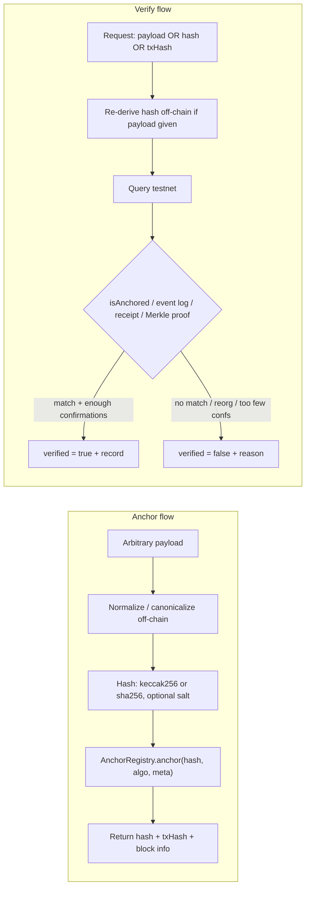
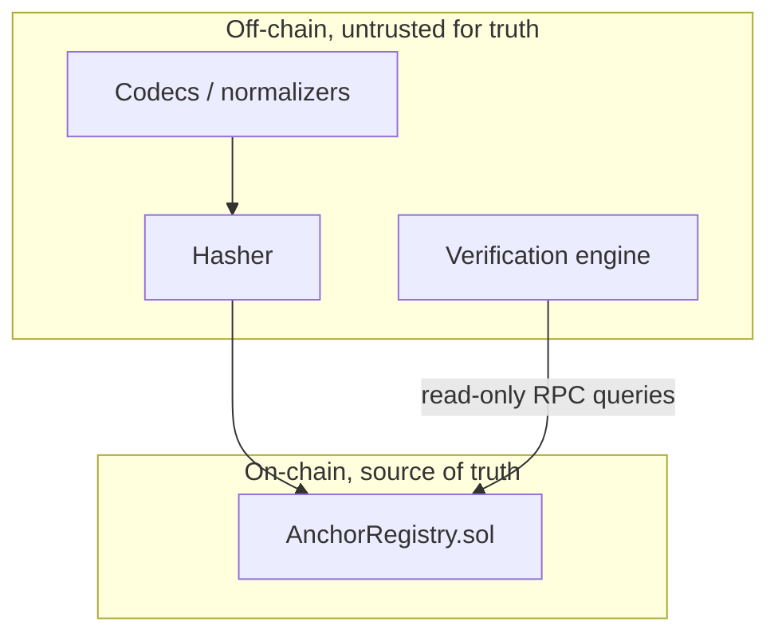
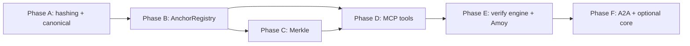
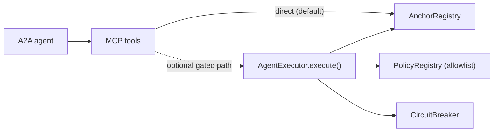

# onchain-agent: Anchor & Verify

> Anchor a cryptographic hash of **any** off-chain payload to a testnet, get back an on-chain
> reference, and later **verify against the live chain** whether that payload was genuinely
> anchored.

This repo implements a single, focused capability: **anchoring** and **verification**. You take
an arbitrary payload (a PDF, a JSON credential, a dataset, a batch of logs — anything), hash it
off-chain, write only that hash on-chain, and can prove later that the exact payload existed at
or before a given block time. Verification always re-derives the hash and re-queries the chain,
so a false claim ("I anchored this") resolves to `verified: false`.

> **Status (v0.1):** Phases **A–F are implemented:**
>
> - **Phase A** — [`@onchain-agent/hash-core`](packages/hash-core): cross-language hashing & canonicalization + Solidity parity tests.
> - **Phase B** — [`AnchorRegistry`](contracts/src/AnchorRegistry.sol): immutable, event-mirrored anchoring (first-seen wins).
> - **Phase C** — Merkle batching: sorted-pair proofs compatible with OpenZeppelin + live anvil integration ([`anchor-e2e`](packages/anchor-e2e)).
> - **Phase D** — [`@onchain-agent/mcp-server`](packages/mcp-server): six Mastra MCP tools over stdio, with live smoke tests against Amoy or local anvil.
> - **Phase E** — [`@onchain-agent/verify-engine`](packages/verify-engine): unified six-method verification engine + optional live Amoy e2e ([`anchor-client`](packages/anchor-client) shared RPC layer).
> - **Phase F** — [`@onchain-agent/a2a-agent`](packages/a2a-agent): Mastra A2A skills (`anchor-payload`, `verify-anchor`) with deterministic tool-routing cores + adversarial tests.
>
> The full spec lives in [docs/PHASE_ANCHOR_VERIFY.md](docs/PHASE_ANCHOR_VERIFY.md).
>
> **Related (separate protocol track):** [docs/PHASE_DEX.md](docs/PHASE_DEX.md) — a from-scratch
> constant-product AMM DEX design doc (same phase-wise, test-first methodology; reuses the safety
> core and `AnchorRegistry` where they fit). Design-only; not part of the anchor/verify capability.
>
> **Distribution (Phases G–M):** [docs/PHASE_DISTRIBUTION.md](docs/PHASE_DISTRIBUTION.md) — publish
> the MCP server and A2A agent to registries and directories, wallet funding playbook for clones,
> and content/community launch steps.

---

## Table of contents

- [The big idea: no fake structure](#the-big-idea-no-fake-structure)
- [How it works](#how-it-works)
- [What you can anchor](#what-you-can-anchor)
- [Hashing & canonicalization](#hashing--canonicalization)
- [On-chain model: `AnchorRegistry`](#on-chain-model-anchorregistry)
- [Verification](#verification)
- [MCP tools (Phase D)](#mcp-tools-phase-d)
- [Repository layout](#repository-layout)
- [Getting started](#getting-started)
- [Build phases & status](#build-phases--status)
- [Optional integration with the safety core](#optional-integration-with-the-safety-core)
- [Agent layer (Phase F preview)](#agent-layer-phase-f-preview)
- [Contributing](#contributing)
- [License](#license)

---

## The big idea: no fake structure

The design rule is non-negotiable: **the chain never sees a payload schema.** The contract sees
only three things:

- a `bytes32` hash (never JSON, never a struct of business fields),
- a 1-byte `uint8 algo` tag that records *how* the hash was produced (so verification can
  re-derive it deterministically), and
- an optional `bytes32 metadataHash` that lets a caller bind extra context (a content-type, a
  codec id) without leaking or constraining the payload itself.

Everything that knows what "a PDF" or "a JSON credential" or "a Merkle batch" *is* lives in an
**off-chain normalizer/codec**. Adding a new payload type is a new off-chain codec plus fixtures,
with **zero contract changes**. That is what "dynamic, no fake structure" means here — we never
invent a bogus on-chain shape to mirror your data.

There are exactly two operations:

1. **Anchor** — normalize a payload off-chain, hash it, write the hash on-chain via
   `AnchorRegistry`, and return `{ hash, txHash, blockNumber, blockTimestamp, chainId }`.
2. **Verify** — given a payload, a hash, or a tx hash, go to the testnet and answer
   `verified: true | false` with a machine-readable reason and the on-chain record.

---

## How it works

### Core flows



### Trust boundary

The off-chain layer can be wrong, malicious, or buggy. Verification always re-derives the hash
and re-queries the chain, so the on-chain registry is the only source of truth.



---

## What you can anchor

Anchoring is payload-agnostic, so the catalog below is about the *off-chain codecs and test
fixtures*, not about any on-chain structure. A condensed view (full taxonomy with privacy notes
in [docs/PHASE_ANCHOR_VERIFY.md §2](docs/PHASE_ANCHOR_VERIFY.md)):

| Category | What is hashed | Verification method |
| --- | --- | --- |
| Documents & legal | Raw bytes of a PDF / signed agreement | Re-hash the file, `isAnchored`, use block timestamp as proof-of-existence |
| Credentials & certificates | Serialized credential (diploma, W3C VC) | Re-canonicalize (JCS) + re-hash, `isAnchored` |
| Files & software artifacts | Release binary, OCI image digest, SBOM, git oid | Re-derive digest, `isAnchored`, cross-check registry/git |
| Structured data / JSON / API responses | A specific API response or config snapshot | Re-canonicalize identically (JCS / EIP-712), re-hash, `isAnchored` |
| Media | Image / audio / video / NFT metadata (exact bytes) | Re-hash exact bytes, `isAnchored` |
| Datasets & AI artifacts | Training data, model weights, eval results, agent logs | `isAnchored(root)` + Merkle proof per shard |
| Logs & audit trails | Agent action logs, policy decisions, compliance streams | Anchor a Merkle root; verify a record via proof |
| Identity / DID | DID document, EAS-style attestation payload | Re-hash canonical form, `isAnchored` |
| Supply chain / provenance | Shipment record, IoT sensor batch | Anchor a root; verify a reading via Merkle proof |
| Financial commitments | Invoice, receipt, escrow terms | Re-derive EIP-712 typed hash, `isAnchored` |
| Pure timestamping | Any opaque digest the caller already holds | `getRecord(hash)` → block timestamp |
| Batched / aggregated | Merkle root over thousands of any of the above | `isAnchored(root)` + per-leaf Merkle proof |

Two takeaways shape the whole design:

- **Two hash algorithms cover almost everything:** `keccak256` (EVM-native, cheapest) and
  `sha256` (ecosystem interop). A 1-byte tag selects between them.
- **Two derivation modes matter:** a **direct hash** of bytes, and a **Merkle root** of many
  leaves. Canonicalization is the #1 source of "valid but won't verify" bugs, so it is a
  first-class, separately tested concern.

---

## Hashing & canonicalization

This is Phase A, the part that is already implemented in
[`@onchain-agent/hash-core`](packages/hash-core).

### Algorithm tags (`uint8 algo`)

Every anchor stores a small, multihash-inspired tag so verification can re-derive correctly. The
TypeScript constants live in [packages/hash-core/src/algoTags.ts](packages/hash-core/src/algoTags.ts):

| `algo` | Meaning | Off-chain derivation |
| --- | --- | --- |
| `0x01` | `keccak256(payloadBytes)` | keccak256 of canonical bytes |
| `0x02` | `sha256(payloadBytes)` | sha256 of canonical bytes |
| `0x11` | `keccak256(salt ‖ payloadBytes)` (salted) | keccak256 of `salt` concatenated with bytes |
| `0x12` | `sha256(salt ‖ payloadBytes)` (salted) | sha256 of `salt` concatenated with bytes |
| `0x20` | keccak256 Merkle root (OZ sorted-pair) | build tree off-chain; anchor the root |

New tags are additive: the contract can *store* a new tag without a redeploy; only the off-chain
codec needs to learn it.

### Pluggable normalizers (codecs)

A normalizer maps a raw payload to the exact `bytes` that get hashed. Each is independently
testable and identified by a stable `codecId`:

- `raw` — bytes used as-is (files, media, binaries, caller-supplied digests). *Implemented.*
- `jcs` — RFC 8785 JSON Canonicalization (structured data, credentials, DID docs).
  *Implemented.*
- `eip712` — EIP-712 `hashStruct` for typed/financial data. *Stub — planned.*
- `safetensors` / `oci-digest` / `git-oid` — adopt the artifact's own canonical digest.
  *Stubs — planned.*

Every normalizer must be **idempotent** (`normalize(normalize(x)) == normalize(x)`) and stable
across platforms (no locale/whitespace/key-order drift). Both are enforced by tests.

### Salted commitments

For enumerable or low-entropy payloads, anchor `H(salt ‖ payload)` (`algo` `0x11`/`0x12`). The
salt is held off-chain by the anchorer and supplied at verification, preventing an observer from
brute-forcing the pre-image from the public hash. Default salt length is 32 bytes from a CSPRNG.

### Merkle batching

- Leaf encoding is fixed: `leaf = keccak256(canonicalLeafBytes)` (optionally salted per leaf).
- Trees use OpenZeppelin's sorted-pair convention so proofs are compatible with
  `MerkleProof.verify` on-chain. See [packages/hash-core/src/merkle.ts](packages/hash-core/src/merkle.ts).
- One root transaction can commit thousands of items; each is later provable with a
  `(leaf, proof[])` pair against the anchored root.

### Cross-language parity guarantee

For `algo` `0x01`/`0x11` and Merkle, the **same hash must be produced by Solidity and by the
TypeScript library** for identical canonical input. This differential parity is the core success
gate of Phase A, enforced by shared golden fixtures in [fixtures/](fixtures) and Foundry tests
including [contracts/test/unit/KeccakParity.t.sol](contracts/test/unit/KeccakParity.t.sol) and
[contracts/test/unit/MerkleAnchor.t.sol](contracts/test/unit/MerkleAnchor.t.sol).

---

## On-chain model: `AnchorRegistry`

**Implemented** in [contracts/src/AnchorRegistry.sol](contracts/src/AnchorRegistry.sol) and
[contracts/src/IAnchorRegistry.sol](contracts/src/IAnchorRegistry.sol) (Phases B/C). The contract is
intentionally tiny and has no payload schema — see
[docs/PHASE_ANCHOR_VERIFY.md §4](docs/PHASE_ANCHOR_VERIFY.md). Tests:
[contracts/test/unit/AnchorRegistry.t.sol](contracts/test/unit/AnchorRegistry.t.sol),
[contracts/test/unit/MerkleAnchor.t.sol](contracts/test/unit/MerkleAnchor.t.sol), plus fuzz and
invariant suites under `contracts/test/`.

### Record shape (packed)

```solidity
struct AnchorRecord {
    address anchorer;       // who anchored (msg.sender)
    uint64  blockTimestamp; // block.timestamp at anchor
    uint64  blockNumber;    // block.number at anchor
    uint8   algo;           // algorithm tag
    bool    isMerkleRoot;   // true if `hash` is a Merkle root
    bytes32 metadataHash;   // optional caller-bound context; 0x0 if unused
}
```

### Interface

```solidity
interface IAnchorRegistry {
    event Anchored(
        bytes32 indexed hash,
        address indexed anchorer,
        uint8   algo,
        bool    isMerkleRoot,
        uint64  blockTimestamp
    );
    event MerkleRootAnchored(
        bytes32 indexed root,
        address indexed anchorer,
        uint8   algo,
        uint64  blockTimestamp
    );

    // Write
    function anchor(bytes32 hash, uint8 algo, bytes32 metadataHash) external;
    function anchorMerkleRoot(bytes32 root, uint8 algo, bytes32 metadataHash) external;

    // Read
    function isAnchored(bytes32 hash) external view returns (bool);
    function getRecord(bytes32 hash) external view returns (AnchorRecord memory);
    function verifyMerkle(bytes32 root, bytes32 leaf, bytes32[] calldata proof)
        external pure returns (bool);
}
```

### Semantics & invariants

- **First-seen wins.** If a `hash` already has a record, `anchor` preserves the original — the
  original `anchorer`/timestamp is never overwritten. This makes the recorded timestamp a
  meaningful "exists at or before T" proof.
- **Value is irrelevant.** Anchoring is a zero-value call; no funds move.
- **Events mirror storage.** Every successful `anchor` emits `Anchored` whose fields equal the
  stored record, so a log-only verifier and a storage verifier agree.
- **`verifyMerkle` is pure.** It does not require the root to be anchored; the verification
  engine composes it with `isAnchored(root)`.

### Target chain

Polygon Amoy testnet, chain ID **80002**. A configurable RPC URL and confirmation depth are
required off-chain (see [Verification](#verification)).

---

## Verification

The verification layer answers one question — "was this genuinely anchored?" — via six
complementary methods. **Phase E** implements all six in [`@onchain-agent/verify-engine`](packages/verify-engine);
MCP tools in Phase D/E delegate to the engine.

| Method | Description | Status |
| --- | --- | --- |
| 1. By hash | `isAnchored(hash)` / `getRecord(hash)` | Phase E — `get_anchor` |
| 2. By payload | Re-derive hash off-chain, then query chain | Phase E — `verify_hash` |
| 3. By tx hash | Decode `Anchored` from receipt | Phase E — `verify_by_tx` |
| 4. By Merkle proof | `verifyMerkle` **and** `isAnchored(root)` | Phase E — `verify_merkle_proof` |
| 5. By event-log scan | Independent `eth_getLogs` cross-check | Phase E — `verify_by_log` |
| 6. By finality | Require `N` confirmations before `verified: true` | Phase E (all verify paths) |

### MCP tools (Phase D/E)

[`@onchain-agent/mcp-server`](packages/mcp-server) exposes six tools via Mastra's stdio
`MCPServer`:

| Tool | Purpose |
| --- | --- |
| `anchor_hash` | Derive a hash (or Merkle root) and write on-chain |
| `verify_hash` | Re-derive from payload, query chain, apply finality |
| `get_anchor` | Look up the stored record for a hash (optional log cross-check) |
| `verify_merkle_proof` | Prove membership in an anchored batch |
| `verify_by_tx` | Verify via transaction receipt + event decode |
| `verify_by_log` | Verify via independent event-log scan (`eth_getLogs`) |

**Core invariant:** `verify_hash` **always re-derives** the hash from the supplied payload — it
never trusts a caller-supplied hash as the query key. A mismatched `claimedHash` returns
`HASH_MISMATCH`; a forged anchor claim returns `NOT_FOUND` or `HASH_MISMATCH`, never
`verified: true`.

Implementation: [packages/mcp-server/src/tools/](packages/mcp-server/src/tools/).

### Result schema

```json
{
  "verified": true,
  "method": "by_payload",
  "hash": "0x…",
  "anchorer": "0x…",
  "blockNumber": 1234567,
  "blockTimestamp": 1750000000,
  "confirmations": 64,
  "chainId": 80002,
  "reason": null
}
```

### Reason / error taxonomy (when `verified = false`)

- `NOT_FOUND` — no record and no matching log for the hash.
- `HASH_MISMATCH` — payload re-derives to a different hash than claimed/anchored.
- `MERKLE_PROOF_INVALID` — leaf/proof does not reconstruct the anchored root.
- `ROOT_NOT_ANCHORED` — Merkle proof is valid but the root itself was never anchored.
- `INSUFFICIENT_CONFIRMATIONS` — anchored but not yet final to the configured depth.
- `REORG` — previously seen tx no longer present at the expected block.
- `ALGO_UNSUPPORTED` — the stored `algo` tag has no off-chain codec available.
- `RPC_ERROR` — transport failure; an *inconclusive* result, never reported as a definitive
  "not anchored".

### Finality configuration

- `CONFIRMATIONS` (default e.g. 64 on Amoy) — minimum depth before `verified = true`.
- `RPC_URL` / `CHAIN_ID` — network selection; `CHAIN_ID` is asserted to be `80002` unless
  overridden, to prevent accidentally verifying against the wrong network.

---

## Repository layout

```
onchain-agent/
├── contracts/                 # Foundry: Solidity contracts + tests
│   ├── src/                   # AnchorRegistry.sol, IAnchorRegistry.sol (Phase B/C)
│   ├── test/                  # unit, fuzz, invariant (+ integration via anchor-e2e)
│   ├── foundry.toml
│   └── lib/                   # forge-std, openzeppelin-contracts (git submodules)
├── packages/
│   ├── hash-core/             # Phase A: deterministic, cross-language hashing library
│   │   ├── src/               # algoTags, algorithms, normalizers, salt, merkle, hashPayload
│   │   └── test/              # unit, fuzz, invariant (vitest)
│   ├── anchor-e2e/            # Phase C: live anvil Merkle root + proof integration
│   ├── anchor-client/         # Phase E: shared config, RegistryClient, result types
│   ├── verify-engine/         # Phase E: unified six-method VerificationEngine
│   ├── mcp-server/            # Phase D/E: Mastra MCPServer, thin tool wrappers, smoke scripts
│   │   ├── src/tools/         # delegate to verify-engine
│   │   ├── scripts/           # smoke-live.ts, smoke-mcp.ts
│   │   └── test/fixtures/     # golden MCP request/response pairs per tool
│   └── a2a-agent/             # Phase F: Mastra A2A skills (anchor-payload, verify-anchor)
│       ├── src/skills/        # deterministic tool-routing cores
│       ├── src/server.ts      # createNodeServer entry (A2A cards + /a2a/<id>), run via tsx
│       └── test/fixtures/     # task→response goldens incl. adversarial case
├── fixtures/                  # shared cross-language goldens (Solidity + TS assert the same)
│   ├── payloads/              # one representative input per taxonomy category
│   ├── expected/              # golden { codecId, algo, salt?, hash } per payload
│   ├── merkle/                # { leaves, root, proofs }
│   ├── verify_cases/          # Phase E golden verification inputs/outputs
│   ├── anchor_requests/       # Phase B golden anchor inputs
│   └── manifest.json
├── docs/
│   ├── PHASE_ANCHOR_VERIFY.md # anchor/verify phase-wise build spec (source of truth)
│   └── PHASE_DEX.md           # separate DEX protocol design spec (design-only)
└── info.md                    # the broader optional "safety core" design
```

Shared goldens live at the repo root on purpose: Solidity and TypeScript assert against the
*same* expected values, which is exactly what enforces parity.

---

## Getting started

### Prerequisites

- **Node.js** 20+ and **pnpm** 10+ (`corepack enable` to get the pinned pnpm).
- **Foundry** (`forge`) for the Solidity side — see [getfoundry.sh](https://getfoundry.sh).
- The contract libraries are git submodules, so clone with submodules (or init them after):

```bash
git clone --recurse-submodules <repo-url>
# or, if already cloned:
git submodule update --init --recursive
```

### Install & build

```bash
pnpm install
forge build --root contracts   # required before e2e tests and contract artifact loading
```

### Run the tests

| Command | What |
| --- | --- |
| `pnpm test` | hash-core (vitest) + Foundry + mcp-server unit/fuzz |
| `pnpm test:all` | above + anchor-e2e + mcp-server anvil e2e |
| `pnpm test:ts` | hash-core only |
| `pnpm test:sol` | Foundry contracts only |
| `pnpm test:mcp` | mcp-server unit/fuzz/fixtures |
| `pnpm test:e2e` | anchor-e2e (Merkle root on live anvil) |
| `pnpm test:mcp:e2e` | mcp-server tools on live anvil |
| `pnpm fixtures` | regenerate shared goldens in `fixtures/` |

### Regenerate the shared fixtures

The golden fixtures in `fixtures/expected/` and `fixtures/merkle/` are generated from the TS
library, then asserted against by both TS and Solidity:

```bash
pnpm fixtures
```

### Use the hashing library

```ts
import { hashPayload, AlgoTag, CodecId } from "@onchain-agent/hash-core";

// Hash raw file bytes with keccak256 (algo 0x01)
const result = hashPayload(fileBytes, {
  codecId: CodecId.RAW,
  algo: AlgoTag.KECCAK256,
});
// => { codecId: "raw", algo: 0x01, hash: "0x…" }

// Canonicalize JSON (RFC 8785) then hash with sha256 (algo 0x02)
const credential = hashPayload({ name: "Ada", id: 42 }, {
  codecId: CodecId.JCS,
  algo: AlgoTag.SHA256,
});

// Salted commitment for a low-entropy payload (algo 0x11) — a fresh 32-byte
// salt is generated and returned so you can store it for verification later
const salted = hashPayload(smallPayload, {
  codecId: CodecId.RAW,
  algo: AlgoTag.KECCAK256_SALTED,
});
// => { codecId: "raw", algo: 0x11, salt: "0x…", hash: "0x…" }
```

For Merkle batching, build a root over many pre-hashed leaves via the `merkle` module
(`buildRoot`, `getProof`, `verify`) — see [packages/hash-core/src/merkle.ts](packages/hash-core/src/merkle.ts).

### Environment configuration

The MCP server reads configuration from the environment. For local development, use a **repo root**
[`.env.local`](.env.local) file (gitignored). It is loaded automatically by
[packages/anchor-client/src/loadEnv.ts](packages/anchor-client/src/loadEnv.ts) (repo root first; optional
`packages/mcp-server/.env.local` fills keys not already set).

Copy [packages/mcp-server/.env.example](packages/mcp-server/.env.example) to `.env.local` and fill in:

| Variable | Purpose |
| --- | --- |
| `RPC_URL` | JSON-RPC endpoint (Amoy Alchemy URL, public Amoy RPC, or `http://127.0.0.1:8545` for anvil) |
| `CHAIN_ID` | `80002` for Polygon Amoy (default), `31337` for local anvil |
| `ANCHOR_REGISTRY_ADDRESS` | Deployed `AnchorRegistry` contract address |
| `ANCHORER_PRIVATE_KEY` | Test wallet key — **required only for `anchor_hash`** (writes) |
| `CONFIRMATIONS` | Minimum confirmations before `verified: true` (default `64`; use `5` for dev) |

For Amoy: create an Alchemy app on **Polygon PoS** (Amoy network), fund a throwaway wallet with
test POL from the [Polygon faucet](https://faucet.polygon.technology/), then deploy the registry
(see below).

### Deploy `AnchorRegistry`

After `forge build`, deploy to your target network. **Use `--broadcast`** — a dry run does not
deploy:

```bash
forge create --root contracts \
  --rpc-url "$RPC_URL" \
  --private-key "$ANCHORER_PRIVATE_KEY" \
  --broadcast \
  src/AnchorRegistry.sol:AnchorRegistry
```

Copy the `Deployed to:` address into `ANCHOR_REGISTRY_ADDRESS`.

**Local alternative:** run `anvil`, set `RPC_URL=http://127.0.0.1:8545`, `CHAIN_ID=31337`, and
use the standard anvil dev key for `ANCHORER_PRIVATE_KEY` (see Foundry docs).

Verify bytecode is on-chain:

```bash
cast code "$ANCHOR_REGISTRY_ADDRESS" --rpc-url "$RPC_URL"
```

### MCP server & smoke tests

Once `.env.local` is configured:

| Command | Purpose |
| --- | --- |
| `pnpm mcp:start` | Start the stdio MCP server (for Cursor, Claude Desktop, etc.) |
| `pnpm mcp:smoke` | Live tool round-trip on your configured chain (no MCP protocol) |
| `pnpm mcp:smoke:mcp` | Full MCP stdio client → server smoke (no IDE required) |
| `pnpm test:verify` | Phase E verification engine tests (mocked RPC) |
| `AMOY_E2E=1 pnpm test:verify:amoy` | Live Amoy e2e: anchor, poll confirmations, verify all methods |

| `pnpm test:verify` | Phase E unit/fuzz/invariant tests (mocked RPC) |
| `AMOY_E2E=1 pnpm test:verify:amoy` | Optional live Amoy anchor-then-verify e2e (requires `.env.local`) |

Phase D/E uses **stdio MCP** — there is no HTTP auth layer. Trust is cryptographic: `verify_hash`
re-derives hashes from payloads; `ANCHORER_PRIVATE_KEY` lives in server env only (not a tool
argument), so callers cannot anchor without the server being configured with a signer.

**Cursor MCP config** (env loaded from repo `.env.local` by the server):

```json
{
  "mcpServers": {
    "onchain-anchor": {
      "command": "pnpm",
      "args": ["--dir", "/path/to/onchain-agent/packages/mcp-server", "start"]
    }
  }
}
```

Replace `/path/to/onchain-agent` with your clone path.

---

## Build phases & status

Every phase is built test-first: write fixtures and failing tests, then implement until green.
Tests follow the unit → fuzz → invariant → integration taxonomy.

- **Phase A — Hashing & canonicalization library.** Deterministic, cross-language hashing for
  all `algo` tags and normalizers, with Solidity/TS differential parity. **Implemented.**
- **Phase B — `AnchorRegistry` anchor + read.** Correct, immutable, event-mirrored anchoring;
  first-seen-wins. **Implemented.**
- **Phase C — Merkle batching.** Sound batch membership; every member leaf verifies, no
  non-member ever does; live anvil integration. **Implemented.**
- **Phase D — MCP server tools.** Six Mastra MCP tools; `verify_hash` always re-derives; Amoy/local
  smoke scripts. **Implemented.**
- **Phase E — Verification engine / Amoy integration.** [`@onchain-agent/verify-engine`](packages/verify-engine)
  with all six methods (including event-log scan + REORG detection), golden `fixtures/verify_cases/`,
  and optional live Amoy e2e (`AMOY_E2E=1 pnpm test:verify:amoy`). **Implemented.**
- **Phase F — A2A skills + docs.** [`@onchain-agent/a2a-agent`](packages/a2a-agent): Mastra-native
  A2A skills (`anchor-payload`, `verify-anchor`), hybrid LLM surface + deterministic cores,
  adversarial fixtures/tests, and anvil e2e. Executor-gated anchoring is documented but
  **out of scope** until `AgentExecutor` contracts land. **Implemented.**

### Phase dependency graph



---

## Optional integration with the safety core

The anchoring/verification capability stands entirely on its own. Phase D exposes it via
[`@onchain-agent/mcp-server`](packages/mcp-server) (stdio MCP tools). Optionally, anchoring can be
routed through the broader "safety core" described in [info.md](info.md) — an executor that
enforces allowlists, spend caps, and a circuit breaker. This is opt-in: anchoring is zero-value
so spend caps are unaffected, but a tripped `CircuitBreaker` can act as a global kill switch.



---

## Agent layer (Phase F)

The agent layer is intentionally a thin translator (A2A task → MCP tool call →
schema-conformant response) with **no policy logic of its own** — all enforcement stays at the
contract layer.

- **Package:** [`@onchain-agent/a2a-agent`](packages/a2a-agent)
- **Framework:** [Mastra](https://mastra.ai) (TypeScript-native), same stack as `hash-core` and the MCP server.
- **Skills:** `anchor-payload` and `verify-anchor`. Deterministic cores route to Phase D MCP tools;
  LLM agents (OpenRouter) are the conversational surface only.
- **Protocols:** MCP via Mastra `MCPClient` (stdio to Phase D server); A2A via Mastra-native
  agent cards at `/.well-known/<agentId>/agent.json` and execution at `POST /a2a/<agentId>`.
  The server boots through `createNodeServer` run with `tsx` (`pnpm a2a:dev`), which transpiles the
  TypeScript workspace packages directly instead of going through the `mastra dev` bundler.
- **Adversarial test:** an orchestrator that *claims* to have anchored a payload it never anchored
  gets `verified: false` (`NOT_FOUND` / `HASH_MISMATCH`).

### Run the A2A agent

```bash
# Unit tests (deterministic cores, no LLM)
pnpm test:a2a

# E2e: skills → MCP tools → AnchorRegistry on anvil
pnpm test:a2a:e2e

# Dev server (needs OPENROUTER_API_KEY + chain env in .env.local)
# Serves A2A on http://localhost:4111 (override with A2A_PORT)
pnpm a2a:dev
```

Once running, fetch an agent card or invoke a skill:

```bash
curl http://localhost:4111/.well-known/anchor-payload/agent.json
curl http://localhost:4111/.well-known/verify-anchor/agent.json
```

Copy [packages/a2a-agent/.env.example](packages/a2a-agent/.env.example) keys into repo root
`.env.local` (chain vars are shared with the MCP server).

---

## Contributing

Contributions are welcome. The workflow is test-first and parity-driven:

1. Add or update a fixture in [fixtures/](fixtures) (a new payload, codec case, or Merkle tree).
2. For MCP tool behavior, add golden pairs under
   `packages/mcp-server/test/fixtures/<tool>/` (`*.input.json` / `*.output.json`).
3. Write the failing test (vitest for TS, Foundry for Solidity).
4. Implement until green, keeping Solidity/TS parity intact.
5. New payload types should land as **off-chain codecs + fixtures** — never as contract changes.

The authoritative spec is [docs/PHASE_ANCHOR_VERIFY.md](docs/PHASE_ANCHOR_VERIFY.md). The contract
surface in §4 is intended to stay frozen.

## License

MIT — see [LICENSE](LICENSE).
