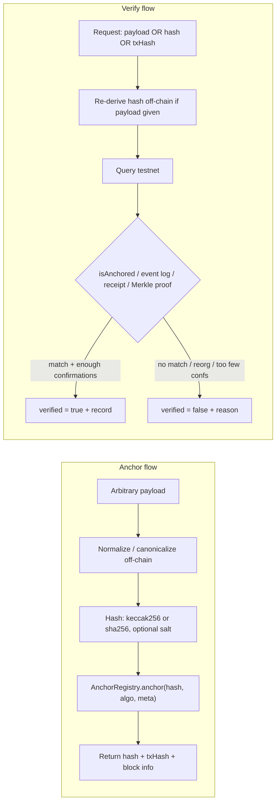
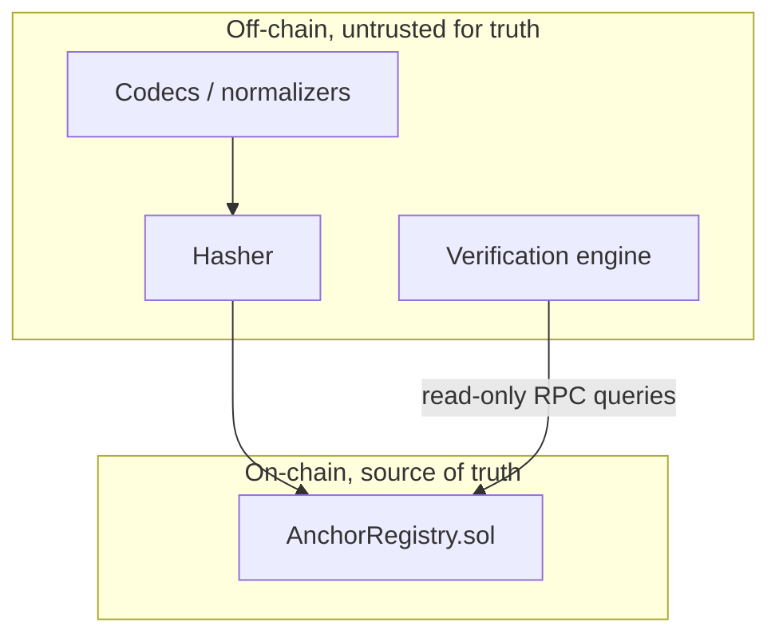
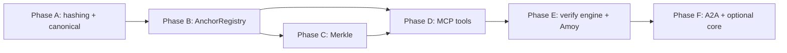
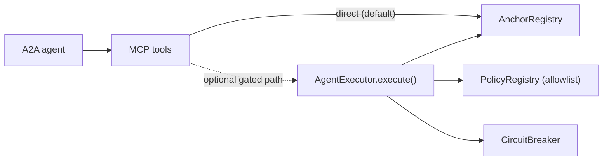

# onchain-agent: Anchor & Verify

> Anchor a cryptographic hash of **any** off-chain payload to a testnet, get back an on-chain
> reference, and later **verify against the live chain** whether that payload was genuinely
> anchored.

This repo implements a single, focused capability: **anchoring** and **verification**. You take
an arbitrary payload (a PDF, a JSON credential, a dataset, a batch of logs — anything), hash it
off-chain, write only that hash on-chain, and can prove later that the exact payload existed at
or before a given block time. Verification always re-derives the hash and re-queries the chain,
so a false claim ("I anchored this") resolves to `verified: false`.

> **Status (v0.1):** Phase A is implemented — the cross-language hashing & canonicalization
> library (`@onchain-agent/hash-core`) plus Solidity parity tests. Phases B–F (the on-chain
> `AnchorRegistry`, Merkle batching, MCP tools, the live verification engine, and the agent
> layer) are fully specified in [docs/PHASE_ANCHOR_VERIFY.md](docs/PHASE_ANCHOR_VERIFY.md) and
> not yet built. This README is a living document and will be updated as each phase lands.

---

## Table of contents

- [The big idea: no fake structure](#the-big-idea-no-fake-structure)
- [How it works](#how-it-works)
- [What you can anchor](#what-you-can-anchor)
- [Hashing & canonicalization](#hashing--canonicalization)
- [On-chain model: `AnchorRegistry`](#on-chain-model-anchorregistry)
- [Verification](#verification)
- [Repository layout](#repository-layout)
- [Getting started](#getting-started)
- [Build phases & status](#build-phases--status)
- [Optional integration with the safety core](#optional-integration-with-the-safety-core)
- [Agent layer (Phase F preview)](#agent-layer-phase-f-preview)
- [Contributing](#contributing)
- [License](#license)

---

## The big idea: no fake structure

The design rule is non-negotiable: **the chain never sees a payload schema.** The contract sees
only three things:

- a `bytes32` hash (never JSON, never a struct of business fields),
- a 1-byte `uint8 algo` tag that records *how* the hash was produced (so verification can
  re-derive it deterministically), and
- an optional `bytes32 metadataHash` that lets a caller bind extra context (a content-type, a
  codec id) without leaking or constraining the payload itself.

Everything that knows what "a PDF" or "a JSON credential" or "a Merkle batch" *is* lives in an
**off-chain normalizer/codec**. Adding a new payload type is a new off-chain codec plus fixtures,
with **zero contract changes**. That is what "dynamic, no fake structure" means here — we never
invent a bogus on-chain shape to mirror your data.

There are exactly two operations:

1. **Anchor** — normalize a payload off-chain, hash it, write the hash on-chain via
   `AnchorRegistry`, and return `{ hash, txHash, blockNumber, blockTimestamp, chainId }`.
2. **Verify** — given a payload, a hash, or a tx hash, go to the testnet and answer
   `verified: true | false` with a machine-readable reason and the on-chain record.

---

## How it works

### Core flows



### Trust boundary

The off-chain layer can be wrong, malicious, or buggy. Verification always re-derives the hash
and re-queries the chain, so the on-chain registry is the only source of truth.



---

## What you can anchor

Anchoring is payload-agnostic, so the catalog below is about the *off-chain codecs and test
fixtures*, not about any on-chain structure. A condensed view (full taxonomy with privacy notes
in [docs/PHASE_ANCHOR_VERIFY.md §2](docs/PHASE_ANCHOR_VERIFY.md)):

| Category | What is hashed | Verification method |
| --- | --- | --- |
| Documents & legal | Raw bytes of a PDF / signed agreement | Re-hash the file, `isAnchored`, use block timestamp as proof-of-existence |
| Credentials & certificates | Serialized credential (diploma, W3C VC) | Re-canonicalize (JCS) + re-hash, `isAnchored` |
| Files & software artifacts | Release binary, OCI image digest, SBOM, git oid | Re-derive digest, `isAnchored`, cross-check registry/git |
| Structured data / JSON / API responses | A specific API response or config snapshot | Re-canonicalize identically (JCS / EIP-712), re-hash, `isAnchored` |
| Media | Image / audio / video / NFT metadata (exact bytes) | Re-hash exact bytes, `isAnchored` |
| Datasets & AI artifacts | Training data, model weights, eval results, agent logs | `isAnchored(root)` + Merkle proof per shard |
| Logs & audit trails | Agent action logs, policy decisions, compliance streams | Anchor a Merkle root; verify a record via proof |
| Identity / DID | DID document, EAS-style attestation payload | Re-hash canonical form, `isAnchored` |
| Supply chain / provenance | Shipment record, IoT sensor batch | Anchor a root; verify a reading via Merkle proof |
| Financial commitments | Invoice, receipt, escrow terms | Re-derive EIP-712 typed hash, `isAnchored` |
| Pure timestamping | Any opaque digest the caller already holds | `getRecord(hash)` → block timestamp |
| Batched / aggregated | Merkle root over thousands of any of the above | `isAnchored(root)` + per-leaf Merkle proof |

Two takeaways shape the whole design:

- **Two hash algorithms cover almost everything:** `keccak256` (EVM-native, cheapest) and
  `sha256` (ecosystem interop). A 1-byte tag selects between them.
- **Two derivation modes matter:** a **direct hash** of bytes, and a **Merkle root** of many
  leaves. Canonicalization is the #1 source of "valid but won't verify" bugs, so it is a
  first-class, separately tested concern.

---

## Hashing & canonicalization

This is Phase A, the part that is already implemented in
[`@onchain-agent/hash-core`](packages/hash-core).

### Algorithm tags (`uint8 algo`)

Every anchor stores a small, multihash-inspired tag so verification can re-derive correctly. The
TypeScript constants live in [packages/hash-core/src/algoTags.ts](packages/hash-core/src/algoTags.ts):

| `algo` | Meaning | Off-chain derivation |
| --- | --- | --- |
| `0x01` | `keccak256(payloadBytes)` | keccak256 of canonical bytes |
| `0x02` | `sha256(payloadBytes)` | sha256 of canonical bytes |
| `0x11` | `keccak256(salt ‖ payloadBytes)` (salted) | keccak256 of `salt` concatenated with bytes |
| `0x12` | `sha256(salt ‖ payloadBytes)` (salted) | sha256 of `salt` concatenated with bytes |
| `0x20` | keccak256 Merkle root (OZ sorted-pair) | build tree off-chain; anchor the root |

New tags are additive: the contract can *store* a new tag without a redeploy; only the off-chain
codec needs to learn it.

### Pluggable normalizers (codecs)

A normalizer maps a raw payload to the exact `bytes` that get hashed. Each is independently
testable and identified by a stable `codecId`:

- `raw` — bytes used as-is (files, media, binaries, caller-supplied digests). *Implemented.*
- `jcs` — RFC 8785 JSON Canonicalization (structured data, credentials, DID docs).
  *Implemented.*
- `eip712` — EIP-712 `hashStruct` for typed/financial data. *Stub — planned.*
- `safetensors` / `oci-digest` / `git-oid` — adopt the artifact's own canonical digest.
  *Stubs — planned.*

Every normalizer must be **idempotent** (`normalize(normalize(x)) == normalize(x)`) and stable
across platforms (no locale/whitespace/key-order drift). Both are enforced by tests.

### Salted commitments

For enumerable or low-entropy payloads, anchor `H(salt ‖ payload)` (`algo` `0x11`/`0x12`). The
salt is held off-chain by the anchorer and supplied at verification, preventing an observer from
brute-forcing the pre-image from the public hash. Default salt length is 32 bytes from a CSPRNG.

### Merkle batching

- Leaf encoding is fixed: `leaf = keccak256(canonicalLeafBytes)` (optionally salted per leaf).
- Trees use OpenZeppelin's sorted-pair convention so proofs are compatible with
  `MerkleProof.verify` on-chain. See [packages/hash-core/src/merkle.ts](packages/hash-core/src/merkle.ts).
- One root transaction can commit thousands of items; each is later provable with a
  `(leaf, proof[])` pair against the anchored root.

### Cross-language parity guarantee

For `algo` `0x01`/`0x11` and Merkle, the **same hash must be produced by Solidity and by the
TypeScript library** for identical canonical input. This differential parity is the core success
gate of Phase A, enforced by shared golden fixtures in [fixtures/](fixtures) and the Foundry
tests [contracts/test/unit/KeccakParity.t.sol](contracts/test/unit/KeccakParity.t.sol) and
`MerkleParity.t.sol`.

---

## On-chain model: `AnchorRegistry`

> Planned for Phase B/C. The interface below is the frozen spec from
> [docs/PHASE_ANCHOR_VERIFY.md §4](docs/PHASE_ANCHOR_VERIFY.md); the contract is intentionally
> tiny and has no payload schema.

### Record shape (packed)

```solidity
struct AnchorRecord {
    address anchorer;       // who anchored (msg.sender)
    uint64  blockTimestamp; // block.timestamp at anchor
    uint64  blockNumber;    // block.number at anchor
    uint8   algo;           // algorithm tag
    bool    isMerkleRoot;   // true if `hash` is a Merkle root
    bytes32 metadataHash;   // optional caller-bound context; 0x0 if unused
}
```

### Interface

```solidity
interface IAnchorRegistry {
    event Anchored(
        bytes32 indexed hash,
        address indexed anchorer,
        uint8   algo,
        bool    isMerkleRoot,
        uint64  blockTimestamp
    );
    event MerkleRootAnchored(
        bytes32 indexed root,
        address indexed anchorer,
        uint8   algo,
        uint64  blockTimestamp
    );

    // Write
    function anchor(bytes32 hash, uint8 algo, bytes32 metadataHash) external;
    function anchorMerkleRoot(bytes32 root, uint8 algo, bytes32 metadataHash) external;

    // Read
    function isAnchored(bytes32 hash) external view returns (bool);
    function getRecord(bytes32 hash) external view returns (AnchorRecord memory);
    function verifyMerkle(bytes32 root, bytes32 leaf, bytes32[] calldata proof)
        external pure returns (bool);
}
```

### Semantics & invariants

- **First-seen wins.** If a `hash` already has a record, `anchor` preserves the original — the
  original `anchorer`/timestamp is never overwritten. This makes the recorded timestamp a
  meaningful "exists at or before T" proof.
- **Value is irrelevant.** Anchoring is a zero-value call; no funds move.
- **Events mirror storage.** Every successful `anchor` emits `Anchored` whose fields equal the
  stored record, so a log-only verifier and a storage verifier agree.
- **`verifyMerkle` is pure.** It does not require the root to be anchored; the verification
  engine composes it with `isAnchored(root)`.

### Target chain

Polygon Amoy testnet, chain ID **80002**. A configurable RPC URL and confirmation depth are
required off-chain (see [Verification](#verification)).

---

## Verification

> Planned for Phase D/E. The verification engine answers one question — "was this genuinely
> anchored?" — via six complementary methods so it never relies solely on a single storage read.

1. **By hash** — `isAnchored(hash)` / `getRecord(hash)`. Cheapest path; returns the record.
2. **By payload** — off-chain re-derive the hash from the payload (declared `algo` + normalizer
   + salt), then run method 1. This is what catches tampering.
3. **By tx hash** — fetch the transaction **receipt**, decode the `Anchored` event, confirm
   `hash`, `anchorer`, and block fields. Proves *which transaction* anchored it.
4. **By Merkle proof** — for batched anchors, call `verifyMerkle(root, leaf, proof)` **and**
   `isAnchored(root)`; both must hold.
5. **By event-log scan** — independent `eth_getLogs` on the `Anchored(hash)` topic, not trusting
   the storage getter. Used as a cross-check and for back-fill.
6. **By finality** — current head vs the record's `blockNumber`; require `N` confirmations.

### Result schema

```json
{
  "verified": true,
  "method": "by_payload",
  "hash": "0x…",
  "anchorer": "0x…",
  "blockNumber": 1234567,
  "blockTimestamp": 1750000000,
  "confirmations": 64,
  "chainId": 80002,
  "reason": null
}
```

### Reason / error taxonomy (when `verified = false`)

- `NOT_FOUND` — no record and no matching log for the hash.
- `HASH_MISMATCH` — payload re-derives to a different hash than claimed/anchored.
- `MERKLE_PROOF_INVALID` — leaf/proof does not reconstruct the anchored root.
- `ROOT_NOT_ANCHORED` — Merkle proof is valid but the root itself was never anchored.
- `INSUFFICIENT_CONFIRMATIONS` — anchored but not yet final to the configured depth.
- `REORG` — previously seen tx no longer present at the expected block.
- `ALGO_UNSUPPORTED` — the stored `algo` tag has no off-chain codec available.
- `RPC_ERROR` — transport failure; an *inconclusive* result, never reported as a definitive
  "not anchored".

### Finality configuration

- `CONFIRMATIONS` (default e.g. 64 on Amoy) — minimum depth before `verified = true`.
- `RPC_URL` / `CHAIN_ID` — network selection; `CHAIN_ID` is asserted to be `80002` unless
  overridden, to prevent accidentally verifying against the wrong network.

---

## Repository layout

```
onchain-agent/
├── contracts/                 # Foundry: Solidity contracts + parity/anchor tests
│   ├── test/unit/             # KeccakParity.t.sol, MerkleParity.t.sol (implemented)
│   ├── foundry.toml
│   └── lib/                   # forge-std, openzeppelin-contracts (git submodules)
├── packages/
│   └── hash-core/             # Phase A: deterministic, cross-language hashing library
│       ├── src/               # algoTags, algorithms, normalizers, salt, merkle, hashPayload
│       └── test/              # unit, fuzz, invariant tests (vitest)
├── fixtures/                  # shared cross-language goldens (Solidity + TS assert the same)
│   ├── payloads/              # one representative input per taxonomy category
│   ├── expected/              # golden { codecId, algo, salt?, hash } per payload
│   ├── merkle/                # { leaves, root, proofs }
│   └── manifest.json
├── docs/
│   └── PHASE_ANCHOR_VERIFY.md # the full phase-wise build spec (source of truth)
└── info.md                    # the broader optional "safety core" design
```

Shared goldens live at the repo root on purpose: Solidity and TypeScript assert against the
*same* expected values, which is exactly what enforces parity.

---

## Getting started

### Prerequisites

- **Node.js** 20+ and **pnpm** 10+ (`corepack enable` to get the pinned pnpm).
- **Foundry** (`forge`) for the Solidity side — see [getfoundry.sh](https://getfoundry.sh).
- The contract libraries are git submodules, so clone with submodules (or init them after):

```bash
git clone --recurse-submodules <repo-url>
# or, if already cloned:
git submodule update --init --recursive
```

### Install

```bash
pnpm install
```

### Run the tests

```bash
pnpm test          # TypeScript (vitest) + Solidity (forge) together
pnpm test:ts       # just the hash-core library
pnpm test:sol      # just the Foundry parity tests
```

### Regenerate the shared fixtures

The golden fixtures in `fixtures/expected/` and `fixtures/merkle/` are generated from the TS
library, then asserted against by both TS and Solidity:

```bash
pnpm fixtures
```

### Use the hashing library

```ts
import { hashPayload, AlgoTag, CodecId } from "@onchain-agent/hash-core";

// Hash raw file bytes with keccak256 (algo 0x01)
const result = hashPayload(fileBytes, {
  codecId: CodecId.RAW,
  algo: AlgoTag.KECCAK256,
});
// => { codecId: "raw", algo: 0x01, hash: "0x…" }

// Canonicalize JSON (RFC 8785) then hash with sha256 (algo 0x02)
const credential = hashPayload({ name: "Ada", id: 42 }, {
  codecId: CodecId.JCS,
  algo: AlgoTag.SHA256,
});

// Salted commitment for a low-entropy payload (algo 0x11) — a fresh 32-byte
// salt is generated and returned so you can store it for verification later
const salted = hashPayload(smallPayload, {
  codecId: CodecId.RAW,
  algo: AlgoTag.KECCAK256_SALTED,
});
// => { codecId: "raw", algo: 0x11, salt: "0x…", hash: "0x…" }
```

For Merkle batching, build a root over many pre-hashed leaves via the `merkle` module
(`buildRoot`, `getProof`, `verify`) — see [packages/hash-core/src/merkle.ts](packages/hash-core/src/merkle.ts).

---

## Build phases & status

Every phase is built test-first: write fixtures and failing tests, then implement until green.
Tests follow the unit → fuzz → invariant → integration taxonomy.

- **Phase A — Hashing & canonicalization library.** Deterministic, cross-language hashing for
  all `algo` tags and normalizers, with Solidity/TS differential parity. **Implemented.**
- **Phase B — `AnchorRegistry` anchor + read.** Correct, immutable, event-mirrored anchoring;
  first-seen-wins. *Planned.*
- **Phase C — Merkle batching.** Sound batch membership; every member leaf verifies, no
  non-member ever does. *Planned.*
- **Phase D — MCP server tools.** Expose the capability as MCP tools (`anchor_hash`,
  `verify_hash`, `get_anchor`, `verify_merkle_proof`, `verify_by_tx`); `verify_hash` always
  re-derives. *Planned.*
- **Phase E — Verification engine / Amoy integration.** The production "go to testnet and check"
  engine: all six methods plus finality, live round trips on Amoy. *Planned.*
- **Phase F — A2A skills + optional core integration + docs.** Reference agent skills
  (`anchor-payload`, `verify-anchor`) and optional wiring into the safety core. *Planned.*

### Phase dependency graph



---

## Optional integration with the safety core

The anchoring/verification capability stands entirely on its own. Optionally, anchoring can be
routed through the broader "safety core" described in [info.md](info.md) — an executor that
enforces allowlists, spend caps, and a circuit breaker. This is opt-in: anchoring is zero-value
so spend caps are unaffected, but a tripped `CircuitBreaker` can act as a global kill switch.



---

## Agent layer (Phase F preview)

> Planned. The agent layer is intentionally a thin translator (A2A task → MCP tool call →
> schema-conformant response) with **no policy logic of its own** — all enforcement stays at the
> contract layer.

- **Framework:** [Mastra](https://mastra.ai) (TypeScript-native), keeping the agent layer in the
  same stack as `hash-core` and the MCP server.
- **Protocols:** MCP via `@modelcontextprotocol/sdk`; A2A via the official `@a2a-js/sdk`
  (interoperable with any A2A agent).
- **Skills:** `anchor-payload` and `verify-anchor`. The key adversarial test: an agent that
  *claims* to have anchored a payload it never anchored must get `verified: false`.
- **LLM provider:** routed through Mastra's Vercel AI SDK layer; default provider OpenRouter,
  model configurable via env so any tool-calling model can be swapped in without code changes.

---

## Contributing

Contributions are welcome. The workflow is test-first and parity-driven:

1. Add or update a fixture in [fixtures/](fixtures) (a new payload, codec case, or Merkle tree).
2. Write the failing test (vitest for TS, Foundry for Solidity).
3. Implement until green, keeping Solidity/TS parity intact.
4. New payload types should land as **off-chain codecs + fixtures** — never as contract changes.

The authoritative spec is [docs/PHASE_ANCHOR_VERIFY.md](docs/PHASE_ANCHOR_VERIFY.md). The contract
surface in §4 is intended to stay frozen.

## License

MIT — see [LICENSE](LICENSE).
