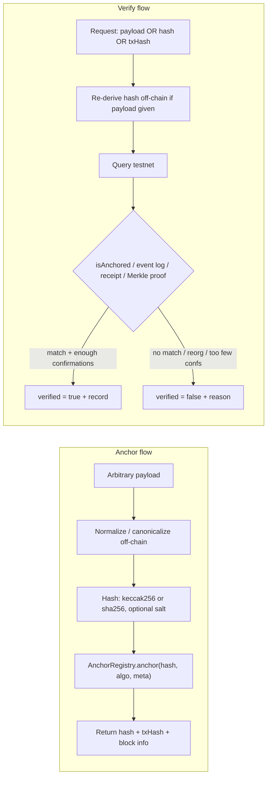
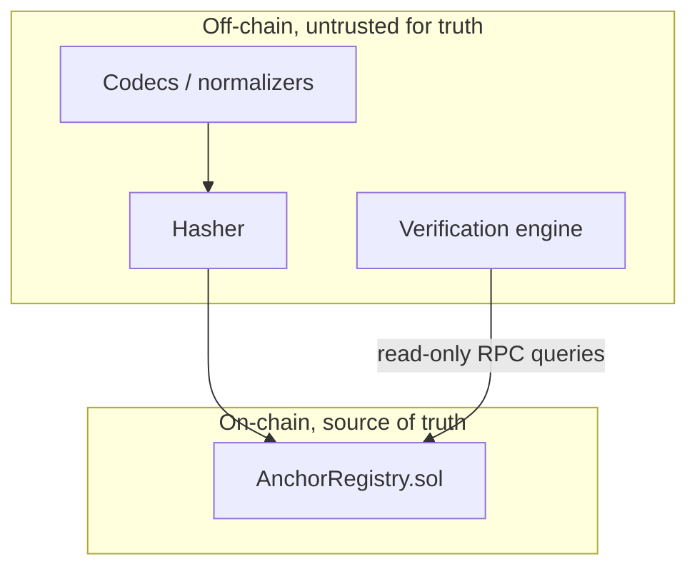
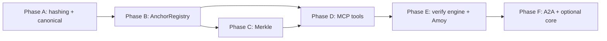
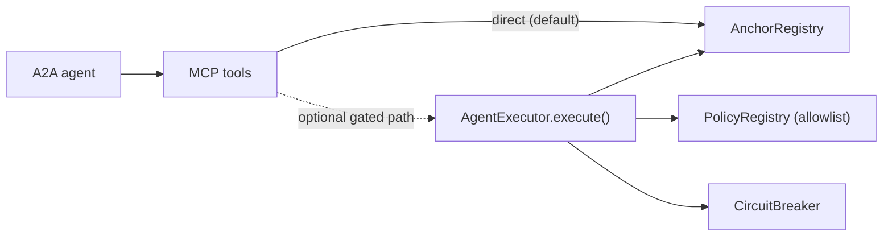

# Anchoring & Verification — Phase-Wise Build Document (v0.1)

> Scope: a single capability for the `onchain-agent` repo — anchor a cryptographic hash of an
> arbitrary off-chain payload to a testnet, return that hash plus an on-chain reference, and
> later **verify against the live testnet** whether a payload/hash was genuinely anchored.
>
> This document is a phase-wise build plan and spec. It is self-contained: the capability can
> be built and tested on its own, with clearly marked **optional** integration points into the
> core architecture in [info.md](../info.md) (PolicyRegistry, AgentExecutor, CircuitBreaker,
> MCP server, A2A agent).
>
> Design rule (non-negotiable): **the chain never sees a payload schema.** It sees only a
> `bytes32` hash, a 1-byte algorithm tag, and an optional `bytes32` metadata hash. All payload
> "shape" lives in pluggable off-chain codecs. We do not invent a fake on-chain structure.

---

## 1. Overview & the dynamic / no-fake-structure principle

The system has exactly two operations:

1. **Anchor** — take any payload, normalize it off-chain, hash it, write the hash on-chain via
  `AnchorRegistry`, and return `{ hash, txHash, blockNumber, blockTimestamp, chainId }`.
2. **Verify** — given a payload, a hash, or a tx hash, go to the testnet and answer
  `verified: true | false` with a machine-readable reason and the on-chain record.

The contract surface is intentionally minimal and payload-agnostic:

- Input is always a `bytes32` (the hash) — never JSON, never a struct of business fields.
- A `uint8 algo` tag (multihash-style) records *how* the hash was produced so verification can
re-derive deterministically.
- An optional `bytes32 metadataHash` lets a caller bind extra context (e.g. a content-type or a
codec id) without leaking or constraining the payload itself.

Everything that knows about "a PDF" vs "a JSON credential" vs "a Merkle batch" is an **off-chain
normalizer/codec**. Adding a new payload type is a new off-chain codec + fixtures, with **zero**
contract changes. That is what "dynamic, no fake structure" means here.

### Core flows




### Trust boundary




The off-chain layer can be wrong, malicious, or buggy; verification always re-derives the hash
and re-queries the chain, so a false claim ("I anchored this") resolves to `verified = false`.

---

## 2. Research — payload taxonomy (what people anchor, and how to verify it)

This catalog drives the off-chain codec set and the test fixtures. For each category we list:
what is actually hashed, the canonicalization concern, the hashing scheme, the verification
method, and the privacy note. None of these require a bespoke on-chain structure.


| Category                               | What is hashed                                                                            | Canonicalization concern                                                                            | Hashing scheme                                | Verification method                                                          | Privacy note                                                  |
| -------------------------------------- | ----------------------------------------------------------------------------------------- | --------------------------------------------------------------------------------------------------- | --------------------------------------------- | ---------------------------------------------------------------------------- | ------------------------------------------------------------- |
| Documents & legal                      | Raw bytes of a PDF / signed agreement / contract                                          | None for raw bytes; strip mutable metadata if reproducibility matters                               | `keccak256` or `sha256` of file bytes         | Re-hash the file, `isAnchored`, check block timestamp for proof-of-existence | Hash leaks nothing; salt only if doc is low-entropy/templated |
| Credentials & certificates             | Serialized credential (diploma, professional cert, W3C VC)                                | JSON Canonicalization (RFC 8785 JCS); for VCs use their canonical proof form                        | `keccak256` over canonical JSON               | Re-canonicalize + re-hash, `isAnchored`                                      | Salted commitment if the credential set is enumerable         |
| Files & software artifacts             | Release binary, container image **digest**, SBOM, package tarball, git commit/tree object | Use the artifact's own digest where one exists (OCI image digest, git oid)                          | `sha256` (ecosystem-native) or `keccak256`    | Re-derive digest, `isAnchored`; cross-check against registry/git             | None — digests are public                                     |
| Structured data / JSON / API responses | A specific API response or config snapshot                                                | **Mandatory** canonicalization (JCS) or EIP-712 typed hashing; key order & whitespace matter        | `keccak256` over JCS, or EIP-712 `hashStruct` | Re-canonicalize identically, re-hash, `isAnchored`                           | Salt if response is small/guessable                           |
| Media                                  | Image / audio / video / NFT metadata, C2PA manifest                                       | Exact-byte hash for tamper-evidence; **perceptual hash is out of scope** (not collision-equivalent) | `sha256` / `keccak256` exact                  | Re-hash exact bytes, `isAnchored`                                            | None for public media                                         |
| Datasets & AI artifacts                | Training dataset, model weights, eval results, model card, agent prompt/response logs     | Stable serialization (e.g. safetensors bytes, sorted record stream); large files → Merkle           | `keccak256`; Merkle root for shardable sets   | `isAnchored(root)` + Merkle proof per shard                                  | Salt for sensitive prompts/PII-bearing logs                   |
| Logs & audit trails                    | Agent action logs, policy decisions, append-only compliance streams                       | Canonical line/record encoding; often batched per time window                                       | Merkle root over records                      | Anchor root; verify a record via Merkle proof                                | Salt per leaf if logs contain PII                             |
| Identity / DID                         | DID document, EAS-style attestation payload                                               | JCS / the standard's canonical form                                                                 | `keccak256` over canonical form               | Re-hash, `isAnchored`; optionally cross-check on-chain attestation           | Salted commitment for selective disclosure                    |
| Supply chain / provenance              | Shipment record, IoT sensor batch, lot/batch record                                       | Canonical record encoding; batch many readings into one root                                        | Merkle root                                   | Anchor root; verify a reading via Merkle proof                               | Salt for commercially sensitive data                          |
| Financial commitments                  | Invoice, receipt, order/escrow terms                                                      | JCS or EIP-712 (these are often typed)                                                              | EIP-712 `hashStruct` or `keccak256`           | Re-derive typed hash, `isAnchored`                                           | Salt for private terms                                        |
| Pure timestamping                      | Any opaque digest the caller already holds                                                | None — caller supplies the hash                                                                     | Caller-supplied (tag records algo)            | `getRecord(hash)` → block timestamp = proof-of-existence at/ before T        | Hash already opaque                                           |
| Batched / aggregated                   | Merkle root over thousands of any of the above                                            | Fixed leaf encoding + sorted-pair hashing (OZ convention)                                           | `keccak256` Merkle                            | `isAnchored(root)` + per-leaf Merkle proof                                   | Per-leaf salting supported                                    |
| Agent-native (project-specific)        | The tx proposal, the `simulate()` result, and the policy decision the agent made          | Canonical encoding of `(target, value, data, decision)`                                             | `keccak256`                                   | Re-encode + re-hash from logs, `isAnchored`                                  | Salt if the proposal is sensitive pre-execution               |


Takeaways that shape the design:

- Two hash algorithms cover virtually everything: `keccak256` (EVM-native, cheapest) and
`sha256` (ecosystem interop). A 1-byte tag selects between them and future additions.
- Two derivation modes matter: **direct hash** of bytes, and **Merkle root** of many leaves.
- Canonicalization is the #1 source of "valid but won't verify" bugs, so it is a first-class,
separately tested concern (Phase A), not an afterthought.
- Salted commitments are needed only for low-entropy/sensitive payloads; they are opt-in.

---

## 3. Hashing & canonicalization design

### 3.1 Algorithm tag (`uint8 algo`)

A small, multihash-inspired tag stored with every anchor so verification re-derives correctly:


| `algo` | Meaning                                 | Off-chain derivation                        |
| ------ | --------------------------------------- | ------------------------------------------- |
| `0x01` | `keccak256(payloadBytes)`               | keccak256 of canonical bytes                |
| `0x02` | `sha256(payloadBytes)`                  | sha256 of canonical bytes                   |
| `0x11` | `keccak256(salt ‖ payloadBytes)` salted | keccak256 of `salt` concatenated with bytes |
| `0x12` | `sha256(salt ‖ payloadBytes)` salted    | sha256 of `salt` concatenated with bytes    |
| `0x20` | keccak256 Merkle root (OZ sorted-pair)  | build tree off-chain; root anchored         |


The tag is advisory to the contract (it stores and emits it) and authoritative to the
off-chain verifier (it dictates how to reproduce the hash). New tags are additive — no contract
redeploy needed to *store* a new tag value; only the off-chain codec must learn it.

### 3.2 Canonicalization strategies (pluggable normalizers)

A normalizer maps a raw payload to the exact `bytes` that get hashed. Each is independently
testable and identified by a `codecId` recorded off-chain (optionally bound via `metadataHash`).

- `raw` — bytes are used as-is (files, media, binaries, caller-supplied digests).
- `jcs` — RFC 8785 JSON Canonicalization Scheme (structured data, credentials, DID docs).
- `eip712` — EIP-712 `hashStruct` for typed/financial data (uses keccak256 by definition).
- `safetensors` / `oci-digest` / `git-oid` — adopt the artifact's own canonical digest.

Property required of every normalizer: **idempotence** — `normalize(normalize(x)) == normalize(x)`
— and **stability** across platforms (no locale/whitespace/key-order drift). Both are tested in
Phase A.

### 3.3 Salted commitments

For enumerable or low-entropy payloads, anchor `H(salt ‖ payload)` (`algo` `0x11`/`0x12`). The
salt is stored off-chain by the anchorer and supplied at verification. This prevents an observer
from brute-forcing the pre-image from the public hash. Salt length default: 32 bytes CSPRNG.

### 3.4 Merkle batching

- Leaf encoding is fixed: `leaf = keccak256(canonicalLeafBytes)` (optionally salted per leaf).
- Tree uses OpenZeppelin's sorted-pair convention so proofs are compatible with
`MerkleProof.verify` / `verifyMerkle` on-chain.
- One `anchorMerkleRoot` transaction can commit thousands of items; each item is later provable
with an `(leaf, proof[])` pair against the anchored root.

### 3.5 On-chain / off-chain parity requirement

For `algo` `0x01`/`0x11` and Merkle, the **same hash must be produced by Solidity and by the
off-chain (TypeScript) library** for identical canonical input. This differential parity is the
core success gate of Phase A.

---

## 4. On-chain anchoring model — `AnchorRegistry.sol`

Chosen model: **dedicated registry contract with storage + events + Merkle support.** The
contract is deliberately tiny and has no payload schema.

### 4.1 Record shape (packed)

```solidity
struct AnchorRecord {
    address anchorer;       // who anchored (msg.sender)
    uint64  blockTimestamp; // block.timestamp at anchor
    uint64  blockNumber;    // block.number at anchor
    uint8   algo;           // algorithm tag (see 3.1)
    bool    isMerkleRoot;   // true if `hash` is a Merkle root
    bytes32 metadataHash;   // optional caller-bound context; 0x0 if unused
}
```

### 4.2 Interface (spec only)

```solidity
interface IAnchorRegistry {
    event Anchored(
        bytes32 indexed hash,
        address indexed anchorer,
        uint8   algo,
        bool    isMerkleRoot,
        uint64  blockTimestamp
    );
    event MerkleRootAnchored(
        bytes32 indexed root,
        address indexed anchorer,
        uint8   algo,
        uint64  blockTimestamp
    );

    // Write
    function anchor(bytes32 hash, uint8 algo, bytes32 metadataHash) external;
    function anchorMerkleRoot(bytes32 root, uint8 algo, bytes32 metadataHash) external;

    // Read
    function isAnchored(bytes32 hash) external view returns (bool);
    function getRecord(bytes32 hash) external view returns (AnchorRecord memory);
    function verifyMerkle(bytes32 root, bytes32 leaf, bytes32[] calldata proof)
        external pure returns (bool);
}
```

### 4.3 Semantics & invariants

- **First-seen wins.** If `hash` already has a record, `anchor` reverts (or is a no-op that
preserves the original) — the original `anchorer`/timestamp is never overwritten. This makes
the recorded timestamp a meaningful "exists at or before T" proof.
- `**value` is irrelevant.** Anchoring is a zero-value call; no funds move. (Relevant when the
optional executor integration applies caps — anchoring never trips a spend cap.)
- **Events mirror storage.** Every successful `anchor` emits `Anchored` whose fields equal the
stored record, so a log-only verifier and a storage verifier agree.
- `**verifyMerkle` is pure.** It does not require the root to be anchored; the verification
engine composes it with `isAnchored(root)` to assert "this leaf is in an anchored batch".

### 4.4 Target chain

Polygon Amoy testnet, chain ID **80002** (per [info.md](../info.md) §6). A configurable RPC URL
and a configurable confirmation depth are required off-chain (see §5.6).

---

## 5. Verification methods (go to the testnet and check)

The verification engine answers one question — "was this genuinely anchored?" — via six
complementary methods. Higher-trust methods avoid relying solely on a single storage read.

1. **By hash** — `isAnchored(hash)` / `getRecord(hash)`. Cheapest path; returns the record.
2. **By payload** — off-chain re-derive the hash from the payload using the declared
  `algo` + normalizer (+ salt), then run method 1. This is what catches tampering: a changed
   payload yields a different hash that is not anchored.
3. **By tx hash** — fetch the transaction **receipt** via RPC, decode the `Anchored` event from
  its logs, and confirm `hash`, `anchorer`, and block fields. Proves *which transaction* did
   the anchoring.
4. **By Merkle proof** — for batched anchors, call `verifyMerkle(root, leaf, proof)` (or verify
  off-chain) **and** `isAnchored(root)`; both must hold.
5. **By event-log scan** — independent `eth_getLogs` filtered on the `Anchored(hash)` topic,
  not trusting the storage getter. Used as a cross-check and for history/back-fill.
6. **By finality** — read current head vs the record's `blockNumber`; require `N` confirmations.
  If too few confirmations or a reorg dropped the tx, return `verified = false` with reason
   `INSUFFICIENT_CONFIRMATIONS` or `REORG`.

### 5.1 Verification result schema

```json
{
  "verified": true,
  "method": "by_payload",
  "hash": "0x…",
  "anchorer": "0x…",
  "blockNumber": 1234567,
  "blockTimestamp": 1750000000,
  "confirmations": 64,
  "chainId": 80002,
  "reason": null
}
```

### 5.2 Reason / error taxonomy (when `verified = false`)

- `NOT_FOUND` — no record and no matching log for the hash.
- `HASH_MISMATCH` — payload re-derives to a hash different from the one claimed/anchored.
- `MERKLE_PROOF_INVALID` — leaf/proof does not reconstruct the anchored root.
- `ROOT_NOT_ANCHORED` — Merkle proof is valid but the root itself was never anchored.
- `INSUFFICIENT_CONFIRMATIONS` — anchored but not yet final to the configured depth.
- `REORG` — previously seen tx no longer present at the expected block.
- `ALGO_UNSUPPORTED` — the stored `algo` tag has no off-chain codec available.
- `RPC_ERROR` — transport failure (distinct from a definitive "not anchored").

`RPC_ERROR` must never be reported as `verified: false` with a "not anchored" meaning — it is an
*inconclusive* result and surfaced as such.

### 5.6 Finality configuration

- `CONFIRMATIONS` (default e.g. 64 on Amoy) — minimum depth before `verified = true`.
- `RPC_URL` / `CHAIN_ID` — network selection; `CHAIN_ID` is asserted to be `80002` unless
overridden, to prevent accidentally verifying against the wrong network.

---

## 6. Phased, test-driven build plan

Every phase is built test-first: write fixtures + failing tests, then implement until green.
"Regression" tests are the unit tests that lock behavior so later phases cannot silently break
earlier guarantees. Test taxonomy mirrors [info.md](../info.md) §3 (unit → fuzz → invariant →
integration).

### Phase A — Hashing & canonicalization library (off-chain TS + on-chain parity)

- **Goal:** deterministic, cross-language hashing for all `algo` tags and normalizers.
- **Success criteria:**
  - For every fixture in `fixtures/payloads/`*, the off-chain hash equals the golden hash in
  `fixtures/expected/*.json`.
  - **Differential parity:** Solidity (Foundry harness) and TS produce identical `keccak256`
  (`0x01`/`0x11`) and Merkle (`0x20`) results for the same canonical input.
  - Every normalizer is idempotent and platform-stable.
- **Input/output fixtures:** `fixtures/payloads/{doc.pdf, credential.json, api_response.json, image.png, log_batch.jsonl, dataset.bin, …}` → `fixtures/expected/<name>.json`
`{ codecId, algo, salt?, hash }`.
- **Unit (regression):** one test per fixture asserting derived hash == golden; salted vs
unsalted; each normalizer's idempotence.
- **Fuzz:** random byte buffers → assert TS keccak256 == Foundry keccak256 (differential);
JCS canonicalization of randomized-key-order JSON yields a single stable output.
- **Invariant:** normalizing already-normalized input is a fixed point for all codecs.
- **Integration:** none (pure libraries).

### Phase B — `AnchorRegistry` anchor + read

- **Goal:** correct, immutable, event-mirrored anchoring.
- **Success criteria:** anchoring records exactly the right fields; duplicates never overwrite;
events equal stored records.
- **Input/output fixtures:** `fixtures/anchor_requests/*.json`
`{ hash, algo, metadataHash }` → expected `{ record, event }` golden files.
- **Unit (regression):** `anchor` then `getRecord` returns expected struct; `isAnchored`
toggles false→true; `Anchored` event fields match; duplicate `anchor` reverts/no-ops with the
original preserved; unknown but well-formed `algo` is still stored.
- **Fuzz:** random `(hash, algo, metadataHash, caller)` → record always reflects inputs and
`msg.sender`; never reverts for valid distinct hashes.
- **Invariant (Foundry handler/actor):**
  - "once anchored, always anchored" — `isAnchored(h)` never returns true→false.
  - "record immutable / first-seen wins" — `anchorer` & `blockTimestamp` for `h` never change.
  - "event ⇔ storage" — for every `Anchored` log, `getRecord` matches.
- **Integration:** none yet (single contract).

### Phase C — Merkle batching

- **Goal:** sound batch membership.
- **Success criteria:** every member leaf verifies with its proof; no non-member ever verifies;
`verifyMerkle` matches the off-chain tree.
- **Input/output fixtures:** `fixtures/merkle/*.json`
`{ leaves[], root, proofs: { leaf: proof[] } }` golden trees.
- **Unit (regression):** `anchorMerkleRoot` + `verifyMerkle(root, leaf, proof) == true` for
members; tampered proof → false; `MerkleRootAnchored` emitted.
- **Fuzz:** random trees of random size → every member verifies; a random non-member leaf fails.
- **Invariant:** "no non-member leaf ever verifies against the root" across random sequences.
- **Integration:** anchor a root on a local node (anvil), then prove a leaf end-to-end.

### Phase D — MCP server tools

- **Goal:** expose the capability as MCP tools, with verification that cannot be faked.
- **Tools:** `anchor_hash`, `verify_hash`, `get_anchor`, `verify_merkle_proof`, `verify_by_tx`.
- **Success criteria:**
  - `verify_hash` **always re-derives** the hash from the supplied payload (never trusts a
  caller-supplied hash) before querying chain.
  - Tool outputs conform to the §5.1 result schema; errors map to the §5.2 taxonomy.
- **Input/output fixtures:** `mcp-server/test/fixtures/<tool>/<case>.{input,output}.json`
golden request/response pairs (including negative cases).
- **Unit (regression):** mocked-RPC tests for each tool covering anchored, not-anchored,
mismatch, and RPC-error paths; `verify_hash` rejects a payload whose claimed hash differs.
- **Fuzz:** random payloads through `anchor_hash` → `verify_hash` round-trips to `verified:true`.
- **Invariant:** a payload mutated by one byte never verifies against the original anchor.
- **Integration:** spin a local node, run the tool layer against a deployed `AnchorRegistry`.

### Phase E — Verification engine / Amoy integration

- **Goal:** the production "go to testnet and check" engine, all six methods + finality.
- **Success criteria:** live anchor-then-verify round trip on Amoy returns `verified:true` with
correct record/confirmations; all negative cases return the right taxonomy reason; the engine
asserts `chainId == 80002`.
- **Input/output fixtures:** `fixtures/verify_cases/*.json` enumerating
`{ input, expected: { verified, method, reason } }` for: anchored-and-final, anchored-but-too-few-confs,
not-anchored, payload-mismatch, valid-merkle, invalid-merkle, root-not-anchored.
- **Unit (regression):** each method in isolation against mocked RPC for every taxonomy reason.
- **Fuzz:** randomized confirmation depths → boundary correctness of
`INSUFFICIENT_CONFIRMATIONS` vs `verified:true`.
- **Invariant:** `RPC_ERROR` is never collapsed into a definitive `verified:false` "not
anchored"; inconclusive stays inconclusive.
- **Integration (live Amoy):** anchor a fresh random payload, poll to required confirmations,
verify by hash / by payload / by tx / by log-scan; assert a never-anchored hash → `NOT_FOUND`.

### Phase F — A2A skills + optional core integration + docs

- **Goal:** reference agent skills and optional wiring into the [info.md](../info.md) core.
- **Skills:** `anchor-payload`, `verify-anchor` (translation only — no policy logic in the agent
layer, per info.md §5.2).
- **Agent framework:** [**Mastra**](https://mastra.ai) (TypeScript-native), chosen to keep the
agent layer in the same TS stack as `hash-core` and the Phase D MCP server — no separate Python
runtime. Rationale: the agent layer is intentionally a thin translator (A2A task → MCP tool call →
schema-conformant response), and Mastra ships both protocols we need as **core dependencies**:
  - **MCP** via `@modelcontextprotocol/sdk` (Mastra `MCPClient`) — connects directly to the Phase D
  MCP server with no extra plugin; `MCPServer` is available if we later expose tools.
  - **A2A** via the official `@a2a-js/sdk` (both client and server sides) — interoperable with any
  A2A agent (ADK, LangGraph, etc.), not a walled garden. Skills are defined as Mastra agents/tools
  and exposed over A2A with no bespoke protocol bridging.
- **LLM provider:** models are routed through Mastra's Vercel AI SDK provider layer; default
provider **OpenRouter** (model configurable; `OPENROUTER_API_KEY` in `.env.local`). Two free,
tool-calling-capable models are the defaults:
  - **Large / orchestration:** `nvidia/nemotron-3-ultra-550b-a55b:free` — hybrid Transformer-Mamba
  MoE (55B active / 550B total), up to 1M-token context, for multi-step reasoning/planning and
  long-running agentic workflows.
  - **Small / fast:** `openai/gpt-oss-20b:free` — open-weight MoE (3.6B active), low-latency, for
  simple/cheap skill calls.
  - Both support function/tool calling (required, since skills only invoke MCP tools). Model
  selection is env/config-driven so either model — or any other tool-calling model — can be
  swapped without code changes. Safety is unaffected: all enforcement stays at the contract layer.
- **Success criteria:**
  - Skills map A2A task → MCP tool call → schema-conformant response.
  - Optional: anchoring routed through `AgentExecutor.execute()` respects allowlist + circuit
  breaker; a paused breaker blocks anchoring.
  - **Adversarial-orchestrator test:** an agent that *claims* to have anchored a payload it
  never anchored → `verify-anchor` returns `verified:false` (`NOT_FOUND`/`HASH_MISMATCH`).
- **Input/output fixtures:** `a2a-agent/test/fixtures/*.json` task→response goldens, incl. the
adversarial case.
- **Unit (regression):** skill request/response mapping; error propagation from MCP taxonomy.
- **Integration:** end-to-end agent → MCP → contract on a local node; optional executor-gated
path with allowlist on and circuit breaker tripped.

### Phase dependency graph




---

## 7. Test fixture & file layout

Shared, cross-language goldens live at the repo root so Solidity, TS, and Python all assert
against the *same* expected values (this is what enforces parity):

```
fixtures/
├── payloads/                 # one representative input per taxonomy category (§2)
│   ├── doc.pdf
│   ├── credential.json
│   ├── api_response.json
│   ├── image.png
│   ├── log_batch.jsonl
│   ├── dataset.bin
│   └── …
├── expected/                 # golden { codecId, algo, salt?, hash } per payload
│   └── <name>.json
├── anchor_requests/          # Phase B inputs → expected { record, event }
├── merkle/                   # Phase C { leaves, root, proofs }
└── verify_cases/             # Phase E { input, expected { verified, method, reason } }
```

Per-package test trees mirror [info.md](../info.md) §3:

```
contracts/test/
├── unit/        AnchorRegistry.t.sol
├── fuzz/        AnchorRegistry.fuzz.t.sol
├── invariant/   AnchorInvariant.t.sol, MerkleInvariant.t.sol
│   └── handlers/ AnchorHandler.sol
└── integration/ AnchorFlow.t.sol

mcp-server/test/fixtures/<tool>/<case>.{input,output}.json
a2a-agent/test/fixtures/*.json
```

Representative payload set (minimum): one file per category in §2 so every codec/normalizer and
both `algo` families (keccak/sha, salted/unsalted, direct/Merkle) are exercised by at least one
golden.

---

## 8. Dynamic guarantees & optional core integration

### 8.1 Dynamic / no-fake-structure guarantees (restated as testable claims)

- The contract ABI contains **no business field** — only `bytes32`, `uint8`, `bool`. Verified by
the `AnchorRegistry` interface in §4 and the Phase B fixtures.
- Adding a new payload type requires **only** a new off-chain codec + fixtures; **no contract
change**. Verified by Phase A/D adding categories without touching §4.
- Verification always re-derives and re-queries; it never trusts caller-supplied hashes
(Phase D `verify_hash` invariant) or a single storage read (method 5 cross-check).

### 8.2 Optional integration with the info.md core (all opt-in)




- **Executor-gated anchoring (optional):** route `anchor` through `AgentExecutor.execute()` with
`AnchorRegistry` allowlisted. Anchoring is zero-value so per-tx/daily caps are unaffected, but
a tripped `CircuitBreaker` blocks anchoring — useful as a global kill switch.
- **MCP exposure:** the tools in Phase D plug into any MCP host (Claude, Cursor, custom).
- **A2A mapping:** the Phase F skills are a reference implementation, not a hard dependency.

These integrations are clearly marked optional throughout so the anchoring/verification
capability stands entirely on its own.

---

*v0.1 draft — phase boundaries and the `algo`/normalizer tables may shift once Phase A parity
tests reveal canonicalization edge cases. The contract surface in §4 is intended to stay frozen;
new payload types should land as off-chain codecs, not contract changes.*