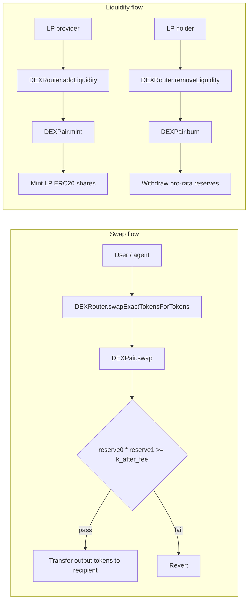
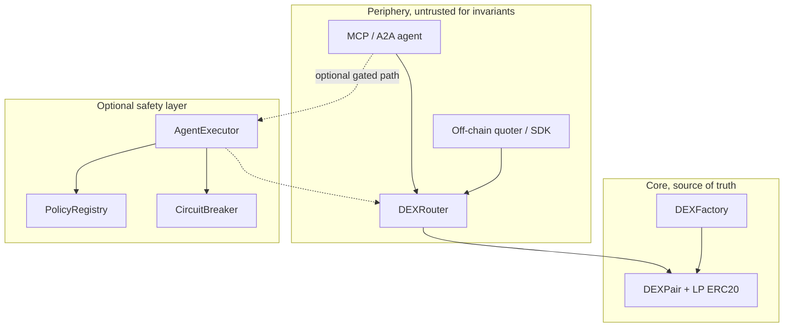
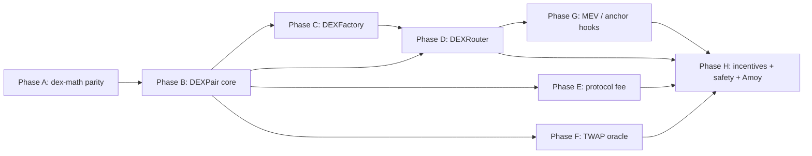
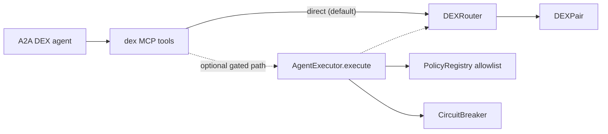

# DEX Protocol — Phase-Wise Build Document (v0.1)

> Scope: a **separate protocol track** for the `onchain-agent` repo — a constant-product AMM
> decentralized exchange (DEX) built from scratch on Polygon Amoy testnet. This document is a
> phase-wise build plan and spec. It is self-contained: the DEX can be built and tested on its
> own, with clearly marked **optional** integration points into the safety core in
> [info.md](../info.md) (PolicyRegistry, AgentExecutor, CircuitBreaker), the anchoring capability
> in [PHASE_ANCHOR_VERIFY.md](./PHASE_ANCHOR_VERIFY.md) (commit-reveal order hashes, batch
> settlement roots), and the MCP/A2A agent layer.
>
> Design rule (non-negotiable): **the pool invariant is sacred.** After every swap, mint, or
> burn, reserves must satisfy `reserve0 * reserve1 >= k` (with fee-adjusted `k` monotonicity on
> swaps). The core `Pair` contract holds all value and enforces this invariant; the `Router` is
> untrusted periphery that never holds critical state.
>
> **Status:** design document only — unaudited testnet spec. No production or mainnet claims.

---

## 1. Overview & the core-invariant principle

The DEX has exactly two user-facing operations:

1. **Swap** — exchange token A for token B against a liquidity pool, paying a swap fee to LPs.
2. **Provide / withdraw liquidity** — deposit both tokens to receive LP shares; burn LP shares
   to withdraw a pro-rata share of pool reserves.

The on-chain core is intentionally small and value-bearing:

- **`DEXPair`** — holds reserves, mints/burns LP ERC20 shares, executes swaps, enforces
  `x * y >= k` (with fee-adjusted monotonicity).
- **`DEXFactory`** — deploys pairs, tracks `(token0, token1) → pair`, optional fee recipient.
- **`DEXRouter`** (periphery) — convenience layer: multi-hop routing, slippage checks, deadlines.
  Holds no long-lived critical state; users can call `Pair` directly.

Everything that knows about "optimal route across three hops" or "minimum output given 1% slippage"
lives in **off-chain quoters and the Router**. Adding a new route shape is a Router/periphery
change, not a core invariant change.

### Core flows



### Trust boundary



The Router can be wrong, malicious, or buggy about slippage math; the **Pair always reverts** if
the invariant would be violated. Off-chain quotes are advisory; on-chain `amountOutMin` and
`deadline` are the user's enforcement layer.

---

## 2. Research — AMM model taxonomy (what curve, and why)

This catalog drives the core design choice and the optional `extensions/` folder. For each model
we list capital efficiency, implementation complexity, audit surface, oracle needs, and typical
use case.


| Model | Curve / mechanism | Capital efficiency | Complexity | Audit surface | Oracle needs | Best for |
| --- | --- | --- | --- | --- | --- | --- |
| **Constant-product (CPMM)** | `x * y = k` | Low–medium | Low | Small, well-understood | TWAP from cumulative price (optional) | General-purpose spot pairs, bootstrapping |
| **Concentrated liquidity (CLMM)** | `x * y = k` per tick range | High | High (tick math, crossing) | Large | Strong TWAP / manipulation-resistant oracle | Mature pairs, stable ranges |
| **StableSwap** | Hybrid constant-sum + product | High for like-assets | Medium | Medium | External price feed or tight bounds | Stablecoin pairs (USDC/USDT) |
| **Order book (on-chain)** | Limit orders in book | High for tight spreads | Very high (gas, matching) | Very large | N/A (price is the book) | Low-throughput, specific assets |
| **Batch auction / CoW** | Off-chain matching, on-chain settlement | Medium | Medium (settlement layer) | Medium | Less sensitive to sandwich | MEV-sensitive large trades |


### Decision: CPMM core (Uniswap-V2-style)

**Chosen for v0.1 core:** constant-product AMM with 0.30% swap fee (30 bps), Uniswap-V2-style
reserve accounting and LP ERC20 shares.

Rationale:

- **Smallest auditable core** with a crisp, testable invariant: `k` never decreases on swaps
  (fee-adjusted); LP shares are pro-rata claims on reserves.
- **Battle-tested pattern** — extensive public audit history, known attack mitigations (min
  liquidity lock, CEI, reentrancy guard).
- **Solidity/TS parity is tractable** — swap and LP math fit in a shared `@onchain-agent/dex-math`
  library with golden fixtures, mirroring Phase A of the anchor doc.
- **Extensions deferred** — concentrated liquidity, StableSwap, and on-chain order books ship as
  clearly labeled `contracts/src/dex/extensions/` with separate invariant suites, per the
  "tiny core + opt-in extensions" pattern in [info.md](../info.md) §2.7.

Takeaways that shape the design:

- **Rounding direction is the #1 source of "valid but drains the pool" bugs** — always round in
  favor of the pool (Phase A, not an afterthought).
- **First-deposit inflation attack** requires a minimum-liquidity lock on the first `mint`.
- **MEV (sandwiching)** is not solvable in core alone; slippage + deadline in Router, optional
  commit-reveal via `AnchorRegistry` in Phase G.
- **TWAP oracle** is optional but specified (Phase F) for integrators who need manipulation-resistant prices.

---

## 3. Protocol math & precision design

### 3.1 Fixed-point representation

- Reserves and amounts use **uint112** in storage (packed with block timestamp for TWAP) and
  **uint256** in math helpers where overflow headroom is needed.
- Prices and cumulative TWAP values use **UQ112x112** fixed-point (112-bit integer, 112-bit
  fractional) for `price0CumulativeLast` / `price1CumulativeLast`.
- All division rounds **down** (floor) unless explicitly noted; the rule is **round in favor of
  the pool** on every operation that could leak value to traders or LPs.

### 3.2 Swap fee math (30 bps default)

Let `fee = 30` (0.30%), `feeDenominator = 10000`.

On an exact-in swap of `amountIn` of token0 for token1:

```
amountInWithFee = amountIn * (feeDenominator - fee)   // 9970/10000 of input
amountOut = (amountInWithFee * reserve1) / (reserve0 * feeDenominator + amountInWithFee)
```

Equivalently, the invariant after swap satisfies:

```
balance0_adjusted * balance1_adjusted >= reserve0 * reserve1 * feeDenominator^2
```

where `balance0_adjusted = balance0 * feeDenominator - amount0In * fee` (and symmetric for token1).

**Invariant (swap):** `k_after >= k_before` when measured with fee-adjusted balances; strict
`>` on swaps with non-zero fee.

### 3.3 LP share mint / burn

**First mint** (totalSupply == 0):

```
liquidity = sqrt(amount0 * amount1) - MINIMUM_LIQUIDITY
```

`MINIMUM_LIQUIDITY` (e.g. 1000 wei of LP shares) is minted to `address(0)` or the factory and
**permanently locked** — defense against first-depositor inflation attack.

**Subsequent mint:**

```
liquidity = min(
  amount0 * totalSupply / reserve0,
  amount1 * totalSupply / reserve1
)
```

**Burn:**

```
amount0 = liquidity * balance0 / totalSupply
amount1 = liquidity * balance1 / totalSupply
```

Use **current balances** (not stale reserves) at burn time so donations/skims are captured fairly.

### 3.4 Protocol fee (optional, Phase E)

When enabled, `_mintFee` accrues 1/6 of the **growth in sqrt(k)** since last fee mint to a
`feeTo` address (Uniswap-V2 `protocolFee` pattern). LP fee remains 0.25% effective to LPs when
protocol takes 0.05% of the 0.30% swap fee.

### 3.5 Rounding rules (summary)


| Operation | Direction | Rationale |
| --- | --- | --- |
| `amountOut` on swap | Floor | Pool keeps dust |
| `liquidity` on mint | Floor | Avoid over-minting shares |
| `amount0/1` on burn | Floor | Pool keeps dust |
| TWAP cumulative update | Full precision in UQ112x112 | Minimize drift over long windows |


### 3.6 On-chain / off-chain parity requirement

For swap quotes, LP mint/burn amounts, and TWAP cumulative deltas, the **same results must be
produced by Solidity library functions and by the TypeScript `@onchain-agent/dex-math` package**
for identical inputs. This differential parity is the core success gate of Phase A.

---

## 4. On-chain contract model

Chosen model: **Factory + Pair core + Router periphery**, deliberately V2-shaped for auditability.
OpenZeppelin `ERC20`, `ReentrancyGuard`, and `AccessControl` are used where applicable.

### 4.1 `IDEXFactory`

```solidity
interface IDEXFactory {
    event PairCreated(address indexed token0, address indexed token1, address pair, uint256);

    function feeTo() external view returns (address);
    function feeToSetter() external view returns (address);
    function getPair(address tokenA, address tokenB) external view returns (address pair);
    function allPairs(uint256) external view returns (address pair);
    function allPairsLength() external view returns (uint256);

    function createPair(address tokenA, address tokenB) external returns (address pair);
    function setFeeTo(address) external;
    function setFeeToSetter(address) external;
}
```

**Semantics:**

- `createPair` sorts tokens (`token0 < token1`), deploys a new `DEXPair`, emits `PairCreated`.
- One pair per unordered token pair; duplicate creation reverts.
- `feeTo` / `feeToSetter` are optional protocol-fee switches (Phase E).

### 4.2 `IDEXPair` (+ LP ERC20)

The pair **is** the LP token (inherits `ERC20`).

```solidity
interface IDEXPair {
    event Mint(address indexed sender, uint256 amount0, uint256 amount1);
    event Burn(address indexed sender, uint256 amount0, uint256 amount1, address indexed to);
    event Swap(
        address indexed sender,
        uint256 amount0In,
        uint256 amount1In,
        uint256 amount0Out,
        uint256 amount1Out,
        address indexed to
    );
    event Sync(uint112 reserve0, uint112 reserve1);

    function MINIMUM_LIQUIDITY() external pure returns (uint256);
    function factory() external view returns (address);
    function token0() external view returns (address);
    function token1() external view returns (address);
    function getReserves() external view returns (uint112 reserve0, uint112 reserve1, uint32 blockTimestampLast);
    function price0CumulativeLast() external view returns (uint256);
    function price1CumulativeLast() external view returns (uint256);
    function kLast() external view returns (uint256);

    function mint(address to) external returns (uint256 liquidity);
    function burn(address to) external returns (uint256 amount0, uint256 amount1);
    function swap(uint256 amount0Out, uint256 amount1Out, address to, bytes calldata data) external;
    function skim(address to) external;
    function sync() external;
}
```

**Semantics & invariants:**

- **`mint(to)`** — caller must have transferred tokens to the pair first; mints LP shares to
  `to` per §3.3; updates to `Sync` updated reserves.
- **`burn(to)`** — burns caller's LP balance; sends pro-rata `token0`/`token1` to `to`.
- **`swap(amount0Out, amount1Out, to, data)`** — optimistic transfer out, optional flash-swap
  callback via `data`, then verify input + invariant; updates TWAP accumulators on first touch
  per block.
- **`skim(to)`** — sends excess token balances over reserves to `to` (donation recovery).
- **`sync()`** — sets reserves to current balances (donation accounting).
- **Reentrancy:** `nonReentrant` on `mint`, `burn`, `swap`; CEI on all state updates.
- **Invariant:** after `swap`, fee-adjusted `k` monotonic; after `mint`/`burn`, total LP supply
  matches pro-rata claim on reserves.

### 4.3 `IDEXRouter`

```solidity
interface IDEXRouter {
    function factory() external pure returns (address);
    function WETH() external pure returns (address);

    function addLiquidity(
        address tokenA,
        address tokenB,
        uint256 amountADesired,
        uint256 amountBDesired,
        uint256 amountAMin,
        uint256 amountBMin,
        address to,
        uint256 deadline
    ) external returns (uint256 amountA, uint256 amountB, uint256 liquidity);

    function removeLiquidity(
        address tokenA,
        address tokenB,
        uint256 liquidity,
        uint256 amountAMin,
        uint256 amountBMin,
        address to,
        uint256 deadline
    ) external returns (uint256 amountA, uint256 amountB);

    function swapExactTokensForTokens(
        uint256 amountIn,
        uint256 amountOutMin,
        address[] calldata path,
        address to,
        uint256 deadline
    ) external returns (uint256[] memory amounts);

    function swapTokensForExactTokens(
        uint256 amountOut,
        uint256 amountInMax,
        address[] calldata path,
        address to,
        uint256 deadline
    ) external returns (uint256[] memory amounts);

    function quote(uint256 amountA, uint256 reserveA, uint256 reserveB) external pure returns (uint256 amountB);
    function getAmountOut(uint256 amountIn, uint256 reserveIn, uint256 reserveOut) external pure returns (uint256 amountOut);
    function getAmountIn(uint256 amountOut, uint256 reserveIn, uint256 reserveOut) external pure returns (uint256 amountIn);
}
```

**Semantics:**

- **`deadline`** — `block.timestamp <= deadline` or revert (`EXPIRED`).
- **Slippage** — `amountOutMin` / `amountAMin` / `amountBMin` enforced after core calls.
- **Path** — `[tokenIn, ..., tokenOut]`; each hop calls `Pair.swap` via computed amounts.
- Router holds no pooled user funds beyond a single tx; WETH unwrap/wrap helpers optional in
  periphery.

### 4.4 `IPriceOracle` (TWAP reader, Phase F)

```solidity
interface IPriceOracle {
    function consult(address pair, address token, uint256 amountIn)
        external view returns (uint256 amountOut);
}
```

Wraps cumulative price difference over `N` blocks; **manipulation cost scales with window length**.

### 4.5 Target chain

Polygon Amoy testnet, chain ID **80002** (per [info.md](../info.md) §6). Configurable RPC URL
and deployment addresses required off-chain for MCP tools and agents.

---

## 5. Security model & attack-vector taxonomy

This section enumerates threats, mitigations, and the test phase that primarily covers each.
Analog of the planned `docs/THREAT_MODEL.md` for the DEX track.


| Threat | Description | Mitigation | Primary test phase |
| --- | --- | --- | --- |
| **Reentrancy** | Callback during `swap`/`mint`/`burn` re-enters pair | `nonReentrant`; CEI; no external calls before state update | B, invariant |
| **Sandwich / MEV** | Attacker front-runs user swap, back-runs price move | User `amountOutMin` + `deadline`; optional commit-reveal (Phase G) | D, G |
| **Oracle manipulation** | Single-block spot price used as oracle | TWAP over long window; document manipulation cost | F |
| **First-deposit inflation** | Attacker manipulates share price on first `mint` | `MINIMUM_LIQUIDITY` locked forever | B |
| **Donation attack** | Direct token transfer skews burn pro-rata | `burn` uses balances not stale reserves; `skim`/`sync` | B |
| **Rounding leakage** | Repeated swaps drain pool via dust | Round in favor of pool (§3.5); fuzz sum of dust bounded | A, fuzz |
| **Flash-loan abuse** | Borrow, manipulate, repay in one tx | Invariant holds within tx; TWAP resists single-block | B, F |
| **Fee-on-transfer tokens** | Actual received < stated amountIn | **Not supported in core v0.1**; document allowlist; extension possible | docs, factory policy |
| **Non-standard ERC20** | Missing return value, hooks | Use OZ SafeERC20; reject non-compliant in factory docs | C |
| **Integer overflow** | Reserve * reserve overflows | Solidity 0.8+ checked math; uint112 reserves | A, B |
| **Admin key compromise** | `feeToSetter` or pause guardian malicious | Roles + timelock extension; `GUARDIAN_ROLE` pause via safety core | H, optional |
| **Router phish** | Malicious router with wrong path | Users verify `factory()` and pair addresses; core unchanged | docs |
| **Cross-function reentrancy** | State inconsistency across functions | Single lock on all mutating entrypoints | invariant |


### 5.1 Reason / revert taxonomy (Router & Pair)

- `EXPIRED` — `block.timestamp > deadline`.
- `INSUFFICIENT_OUTPUT_AMOUNT` — slippage check failed.
- `INSUFFICIENT_LIQUIDITY` — mint/burn/swap cannot proceed.
- `INSUFFICIENT_INPUT_AMOUNT` — zero or negative effective input.
- `INVALID_PAIR` — path hop pair does not exist.
- `K` — invariant violation on swap (internal).
- `TRANSFER_FAILED` — ERC20 transfer/transferFrom failed.

### 5.2 Audit posture

- Core (`Factory` + `Pair`) optimized for **minimal line count** and **single invariant family**.
- Periphery (`Router`) explicitly **out of audit critical path** for LP funds — bugs cause failed
  txs, not drained pools, if Pair checks are correct.
- Document **unaudited** status prominently until external audit completes.

---

## 6. Phased, test-driven build plan

Every phase is built test-first: write fixtures + failing tests, then implement until green.
"Regression" tests lock behavior so later phases cannot silently break earlier guarantees. Test
taxonomy mirrors [info.md](../info.md) §3 and [PHASE_ANCHOR_VERIFY.md](./PHASE_ANCHOR_VERIFY.md) §6
(unit → fuzz → invariant → integration).

### Phase A — DEX math library (off-chain TS + on-chain parity)

- **Goal:** deterministic swap, mint, burn, and quote math with identical Solidity/TS outputs.
- **Success criteria:**
  - For every fixture in `fixtures/dex/math/`, TS `@onchain-agent/dex-math` equals golden
    `expected/*.json`.
  - **Differential parity:** Foundry `DEXMath.t.sol` and TS produce identical `getAmountOut`,
    `getAmountIn`, `quote`, mint liquidity, and burn pro-rata for the same inputs.
  - Rounding always favors the pool (property tests).
- **Fixtures:** `{ reserve0, reserve1, amountIn } → { amountOut }`; edge cases (tiny swap, large
  swap near empty, first mint).
- **Unit (regression):** one test per golden; boundary at `MINIMUM_LIQUIDITY`.
- **Fuzz:** random reserves + amountIn → `amountOut <= reserveOut`; `k_after >= k_before`.
- **Invariant:** `getAmountOut(amountIn, r0, r1) <= r1` for all valid inputs.
- **Integration:** none (pure libraries).

### Phase B — `DEXPair` core (mint / burn / swap)

- **Goal:** value-bearing pair with fee-adjusted k-monotonic swaps and LP accounting.
- **Success criteria:** mint/burn/swap match goldens; duplicate invariant violations revert;
  `MINIMUM_LIQUIDITY` locked on first mint.
- **Fixtures:** `fixtures/dex/pair_ops/*.json` → expected reserves, LP supply, events.
- **Unit (regression):** single-hop swap exact-in; add/remove liquidity; `skim`/`sync` after
  donation.
- **Fuzz:** random sequence of mint/swap/burn → reserves never negative; LP totalSupply consistent.
- **Invariant (Foundry handler):**
  - "k monotonic on swap" — fee-adjusted product never decreases.
  - "LP pro-rata" — sum of burn payouts ≤ pool balances.
  - "no free lunch" — swap without input reverts.
- **Integration:** local anvil deploy pair with mock ERC20s; full mint→swap→burn script.

### Phase C — `DEXFactory` + pair deployment

- **Goal:** canonical pair registry and CREATE2 or standard deploy pattern.
- **Success criteria:** `getPair(A,B) == getPair(B,A)`; duplicate `createPair` reverts; emitted
  `PairCreated` matches deployed bytecode.
- **Fixtures:** token address pairs → expected pair address (if CREATE2 deterministic).
- **Unit (regression):** create two pairs; lookup; length counter.
- **Fuzz:** random token addresses → unique pairs, sorted token0/token1.
- **Invariant:** `allPairs` contains no duplicates; `pair.factory() == factory`.
- **Integration:** factory deploy + createPair + addLiquidity via Router on anvil.

### Phase D — `DEXRouter` / periphery

- **Goal:** slippage-protected swaps and liquidity UX; multi-hop routing.
- **Success criteria:** `amountOutMin` enforced; expired deadline reverts; path encoding correct
  for 2- and 3-hop swaps.
- **Fixtures:** `fixtures/dex/router/*.json` input/output for add/remove/swap paths.
- **Unit (regression):** exact-in / exact-out; multi-hop; revert on `EXPIRED` and slippage fail.
- **Fuzz:** random paths (length 2–4) with bounded reserves → output ≤ sequential quote sum.
- **Invariant:** Router never leaves pair in violating state (delegate to Pair invariants).
- **Integration:** Router end-to-end on anvil with two pairs (A-B, B-C) for A→C hop.

### Phase E — Protocol fee accrual

- **Goal:** optional `feeTo` share of LP fee via sqrt(k) growth minting.
- **Success criteria:** when `feeTo` enabled, `kLast` tracking mints fee LP to `feeTo`; when
  disabled, no extra mint.
- **Fixtures:** reserve growth sequences → expected feeTo LP mint amount.
- **Unit (regression):** toggle fee on/off; feeTo change mid-flight.
- **Fuzz:** random swaps between fee snapshots → feeTo balance monotonic.
- **Invariant:** total LP claims + feeTo claims ≤ token balances.
- **Integration:** factory setFeeTo + swaps + assert feeTo LP balance increased.

### Phase F — TWAP oracle

- **Goal:** manipulation-resistant cumulative price over configurable window.
- **Success criteria:** `consult(pair, token, amountIn)` matches manual cumulative delta over N
  blocks in test harness.
- **Fixtures:** reserve paths over blocks → cumulative price deltas.
- **Unit (regression):** single-block touch updates accumulator once; overflow in UQ112x112 bounds.
- **Fuzz:** random reserve paths → consult over 1 block == spot (document risk); over 100+ blocks
  resists single large manipulation in test scenario.
- **Invariant:** cumulative price monotonic in time for monotonic price series.
- **Integration:** multi-block anvil mine + consult matches off-chain calculator.

### Phase G — MEV protection hooks (optional, reuses AnchorRegistry)

- **Goal:** commit-reveal swap intent and/or batch-auction settlement root anchoring.
- **Success criteria:**
  - User commits `keccak256(salt ‖ order)` via off-chain hash + optional `AnchorRegistry.anchor`;
    reveal within window executes at committed max slippage or reverts.
  - Batch settlement: Merkle root of filled orders anchored; each fill provable via
    `verifyMerkle` + `isAnchored(root)` (reuses [PHASE_ANCHOR_VERIFY.md](./PHASE_ANCHOR_VERIFY.md)
    Phase C/E).
  - EIP-712 typed `Order` hashing via `@onchain-agent/hash-core` `eip712` codec (when implemented).
- **Fixtures:** order structs → commit hash; Merkle batches → roots + proofs.
- **Unit (regression):** reveal without commit fails; expired reveal fails; valid proof executes.
- **Fuzz:** random orders → commit/reveal round-trip.
- **Invariant:** committed max price never exceeded on reveal.
- **Integration:** anchor commit hash on Amoy → reveal swap on anvil mock matcher.

### Phase H — Incentives, governance, safety core, Amoy deploy + docs

- **Goal:** optional gauge emissions, governance hooks, AgentExecutor-gated swaps, production
  testnet deployment.
- **Success criteria:**
  - Optional: `StakingRewards` / gauge stub accrues emission token to LP stakers (clearly
    labeled extension).
  - Optional: swaps routed through `AgentExecutor.execute()` respect allowlist + circuit breaker.
  - Amoy deploy script with conservative caps; addresses documented.
  - MCP tools: `quote_swap`, `swap_exact_tokens`, `add_liquidity`, `remove_liquidity`, `get_pair_reserves`.
- **Fixtures:** MCP golden request/response pairs per tool.
- **Unit (regression):** policy blocks non-allowlisted router; paused breaker blocks execute.
- **Integration:** live Amoy swap with test tokens; agent → MCP → Router path.

### Phase dependency graph



---

## 7. Test fixture & file layout

Shared goldens live at the repo root (or under `fixtures/dex/`) so Solidity and TS assert against
the *same* expected values:

```
fixtures/dex/
├── math/                    # Phase A: swap/mint/burn quote inputs
│   └── *.json               # { reserves, amountIn, expectedOut, rounding }
├── pair_ops/                # Phase B: mint/swap/burn sequences
│   └── *.json
├── router/                  # Phase D: path swaps, slippage cases
│   └── *.json
├── twap/                    # Phase F: multi-block cumulative price
│   └── *.json
├── mev/                     # Phase G: commit-reveal + Merkle settlements
│   └── *.json
└── mcp/                     # Phase H: tool request/response goldens
    └── <tool>/<case>.{input,output}.json
```

Per-package layout (proposed):

```
contracts/
├── src/dex/
│   ├── DEXFactory.sol
│   ├── DEXPair.sol
│   ├── DEXRouter.sol
│   ├── libraries/DEXMath.sol
│   └── extensions/          # optional: StableSwap, CLMM — not core
├── test/dex/
│   ├── unit/
│   ├── fuzz/
│   ├── invariant/
│   │   └── handlers/DEXHandler.sol
│   └── integration/
└── script/
    ├── DeployDEXLocal.s.sol
    └── DeployDEXAmoy.s.sol

packages/
├── dex-math/                # Phase A: TS mirror of DEXMath.sol
│   ├── src/
│   └── test/
└── dex-mcp/                 # Phase H: MCP tools (or extend mcp-server)
    ├── src/tools/
    └── test/fixtures/
```

### Invariant catalog (Foundry)


| ID | Property | Handler |
| --- | --- | --- |
| INV-1 | Fee-adjusted k monotonic after every swap | `DEXHandler.swap` |
| INV-2 | `totalSupply` LP × pro-rata ≤ token balances | mint/burn alternation |
| INV-3 | Sum of user gains ≤ sum of user inputs + donations | random sequences |
| INV-4 | `getPair(A,B) == getPair(B,A)` | factory creates |
| INV-5 | Router slippage revert ⇒ pair reserves unchanged | snapshot before/after failed tx |

---

## 8. Tokenomics, governance & optional integration

### 8.1 Fee distribution (default)

- **LP fee:** 0.30% on swaps, retained in pool (increases `k`, benefits all LP holders).
- **Protocol fee (optional):** 1/6 of LP fee to `feeTo` when enabled (Phase E).
- No native governance token in core v0.1; `feeToSetter` is a simple admin address.

### 8.2 Optional incentive layer (extension, Phase H)

Clearly labeled **non-core** extension:

- **`GaugeController`** — stake LP tokens, earn emission token at schedule rate.
- **`veToken` voting** — vote on gauge weights (future; document only in v0.1).
- Emissions are **not** required for DEX correctness; pools function without gauges.

### 8.3 Optional integration with safety core ([info.md](../info.md))



- **Executor-gated swaps (optional):** route Router calls through `AgentExecutor` with DEX
  contracts allowlisted. Per-tx and daily caps apply to **native token value** sent with swap
  (usually zero for ERC20-only swaps; relevant for ETH-bearing paths).
- **Circuit breaker:** guardian `manualPause()` blocks all gated swaps during incident response.
- **PolicyRegistry:** only approved Router/Pair addresses callable by agent keys.

### 8.4 Optional integration with AnchorRegistry ([PHASE_ANCHOR_VERIFY.md](./PHASE_ANCHOR_VERIFY.md))

- **Commit-reveal orders (Phase G):** hash structured order (EIP-712) off-chain; anchor commit
  hash for timestamp proof; reveal within TTL.
- **Batch auction settlement:** anchor Merkle root of `(orderId, fillAmount)` batch; integrators
  verify fills via `verifyMerkle` + `isAnchored(root)`.
- Reuses `@onchain-agent/hash-core` for canonical order encoding and Merkle trees — **no changes
  to `AnchorRegistry` contract surface**.

### 8.5 MCP / A2A agent surface (Phase H)

| Tool | Purpose |
| --- | --- |
| `quote_swap` | Off-chain quote via `dex-math`; read-only |
| `get_pair_reserves` | `getReserves()` for a pair |
| `swap_exact_tokens` | Router `swapExactTokensForTokens` (requires signer in env) |
| `add_liquidity` | Router `addLiquidity` |
| `remove_liquidity` | Router `removeLiquidity` |
| `check_dex_paused` | Optional: `CircuitBreaker.isPaused()` |

Agent layer contains **no invariant logic** — slippage and deadlines are parameters on each tool
call; Pair enforces math on-chain.

### 8.6 Documentation deliverables (with Phase H)

- `docs/PHASE_DEX.md` — this document (source of truth for DEX track).
- `docs/DEX_ARCHITECTURE.md` — core vs periphery diagram, deployment addresses.
- `docs/DEX_SECURITY.md` — audit status, responsible disclosure, known limitations (fee-on-transfer
  unsupported, MEV on public mempool).
- `docs/DEX_THREAT_MODEL.md` — expanded §5 with actor profiles (LP, trader, searcher, admin).

---

## 9. Dynamic guarantees (restated as testable claims)

- The **Pair** enforces **fee-adjusted k-monotonicity** on every swap — verified by Phase B
  invariants and Phase A fuzz.
- The **Router** cannot drain a Pair that correctly implements §4.2 — verified by adversarial
  Router tests that attempt underpayment (must revert at Pair).
- **Solidity/TS math parity** — verified by shared goldens in Phase A; regression runs in CI.
- **Optional extensions** (`extensions/`, gauges, CLMM) are **not** in the audit-critical path
  for core LP funds unless explicitly promoted to core after separate audit.

---

* v0.1 draft — phase boundaries and fee parameters may shift once Phase A parity tests reveal
rounding edge cases. The core `Pair` invariant in §3–§4 is intended to stay frozen; new curve
types and order-book matchers should land as `extensions/` or periphery modules, not changes to
the CPMM `k`-monotonicity rule.*
