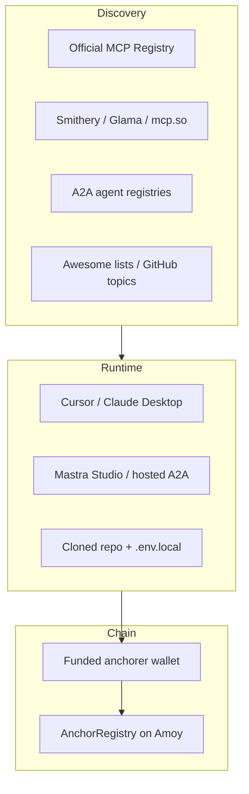
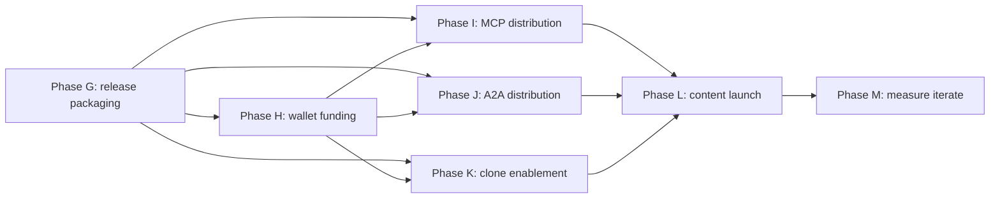

# Distribution & Adoption — Phase-Wise Launch Document (v0.1)

> Scope: take the **implemented** anchor/verify stack (Phases A–F in
> [PHASE_ANCHOR_VERIFY.md](./PHASE_ANCHOR_VERIFY.md)) and **publish it** so developers can
> discover, clone, deploy, and **trigger** the agent with a **funded wallet** on testnet (and
> optionally mainnet). This document is a phase-wise launch plan — self-contained, with explicit
> steps, actions, and done-when criteria per phase.
>
> **Prerequisites:** Phases A–F are green locally; Amoy (chain ID `80002`) is the default target;
> [`@onchain-agent/mcp-server`](../packages/mcp-server) and
> [`@onchain-agent/a2a-agent`](../packages/a2a-agent) are the distribution surfaces.
>
> **Scope decisions (locked for v0.1):**
>
> - **Wallet / mandate:** provisioning + funding **playbook only** — no new AP2/x402 protocol
>   code in this phase. Optional future integrations are documented but out of build scope.
> - **Network:** **testnet-first** (Polygon Amoy); mainnet hardening is an explicit optional
>   sub-phase inside Phase H.

---

## 1. Overview — what “distribution” means here

Distribution is not a single blog post or a single registry submission. It is a **pipeline**:

1. **Package** the MCP server and A2A agent so they install and run outside this monorepo.
2. **Fund** every deployment with enough native token (POL on Amoy) so `anchor_hash` writes succeed.
3. **List** the server/agent on every major MCP and A2A discovery surface.
4. **Enable clones** — one-click deploy, template repo, copy-paste env setup.
5. **Drive adoption** — dev communities, crypto-native channels, compounding content.
6. **Measure** — know which channels send real installs, not vanity metrics.

### Distribution surfaces (two protocols, one capability)



### Trust & funding boundary

- **Verify** is read-only RPC — no wallet balance required.
- **Anchor** requires `ANCHORER_PRIVATE_KEY` in server env (never a tool argument) and **POL for
  gas**. An unfunded wallet must fail **loudly** (preflight balance check), not mid-tx with an
  opaque RPC error.
- Each clone / deployment gets its **own throwaway signer**. Never reuse production keys across
  forks or public demos.

### Phase dependency graph (G → M)



---

## 2. Submission targets (master table)

Use this table as the canonical checklist. “Automated?” refers to whether a CLI/script can submit
without manual browser work.

| Target | Method | Automated? | Transport / artifact | Link |
| --- | --- | --- | --- | --- |
| Official MCP Registry | `mcp-publisher publish` + npm package | Yes (CI on tag) | npm + `server.json` | [registry.modelcontextprotocol.io](https://registry.modelcontextprotocol.io/) |
| GitHub MCP Registry | Syncs from official registry | Auto after official | npm | GitHub MCP catalog |
| Smithery | URL publish or `.mcpb` bundle | Partial (CLI) | **HTTPS** or MCPB | [smithery.ai/new](https://smithery.ai/new) |
| Glama | Indexes public GitHub repos | Auto (if public) | stdio repo | [glama.ai/mcp/servers](https://glama.ai/mcp/servers) |
| mcp.so | PR adding one markdown line | Yes (PR) | stdio repo | [github.com/chatmcp/mcpso](https://github.com/chatmcp/mcpso) |
| PulseMCP | Web form | No (opens form) | either | [pulsemcp.com/submit](https://www.pulsemcp.com/submit) |
| mcpservers.org | Web form | No | either | mcpservers.org submit |
| awesome-mcp-servers (punkpeye) | GitHub PR | Yes (PR) | either | [github.com/punkpeye/awesome-mcp-servers](https://github.com/punkpeye/awesome-mcp-servers) |
| awesome-mcp-servers (appcypher) | GitHub PR | Yes (PR) | either | [github.com/appcypher/awesome-mcp-servers](https://github.com/appcypher/awesome-mcp-servers) |
| Docker MCP Registry | GitHub PR | Yes (if Dockerfile) | Docker image | Docker MCP catalog |
| Claude Desktop Extensions | Browser directory | No | stdio / MCPB | Anthropic directory |
| Cursor MCP docs / community | Docs link + forum | Manual | stdio | Cursor docs / forum |
| Mastra templates gallery | Contribution form | Paused (2026) | standalone repo | [mastra.ai/templates](https://mastra.ai/templates) |
| A2A well-known card | Host `/.well-known/agent-card.json` | Self-serve | HTTP A2A | [a2a-protocol.org](https://a2a-protocol.org/) |
| StackA2A / curated registries | POST agent card URL | Varies | HTTP A2A | [stacka2a.dev](https://stacka2a.dev/) |
| **Fan-out shortcut** | `npx mcp-submit` | Partial | detects from repo | [npm: mcp-submit](https://www.npmjs.com/package/mcp-submit) |

**Transport note:** Today the MCP server is **stdio-only** ([README](../README.md) § MCP). Glama
and mcp.so accept stdio repos; Smithery URL publishing requires a **hosted Streamable HTTP**
endpoint (Phase G optional deliverable).

---

## 3. Phase G — Release & packaging readiness

**Goal:** every registry and `npx` install path can consume a **published artifact**, not raw
monorepo TypeScript.

**Depends on:** Phases A–F green; `pnpm test:all` passes.

### G.1 npm publish `@onchain-agent/mcp-server`

| Step | Action |
| --- | --- |
| 1 | Remove `"private": true` from [packages/mcp-server/package.json](../packages/mcp-server/package.json). |
| 2 | Add `"mcpName": "io.github.<org>/onchain-anchor"` (must match registry namespace after GitHub auth). |
| 3 | Add a **build step** that emits `dist/` (esbuild or `tsc`) — registries and `npx` cannot rely on workspace `tsx` + raw `.ts` in production. |
| 4 | Point `"bin"."onchain-anchor-mcp"` at compiled `dist/server.js` with `#!/usr/bin/env node`. |
| 5 | Publish workspace deps (`hash-core`, `anchor-client`, `verify-engine`) **or** bundle them into the MCP package for v0.1 (simpler for adopters). |
| 6 | Verify: `npx @onchain-agent/mcp-server` starts stdio MCP and responds to `tools/list`. |

**Done when:** `npm view @onchain-agent/mcp-server` resolves; fresh machine install works with
env vars only (no monorepo clone required for MCP-only use).

### G.2 `server.json` for official MCP Registry

| Step | Action |
| --- | --- |
| 1 | Install CLI: `brew install mcp-publisher` or download from [modelcontextprotocol/registry](https://github.com/modelcontextprotocol/registry). |
| 2 | Run `mcp-publisher init` in `packages/mcp-server/` — generates `server.json` against `$schema`. |
| 3 | Fill: name, description, version, npm package name, stdio launch command, tool list (six tools). |
| 4 | Validate JSON Schema locally before publish. |
| 5 | Authenticate: `mcp-publisher login github` (namespace `io.github.<username>/…`). |

**Example `server.json` fields (illustrative):**

```json
{
  "name": "io.github.yourorg/onchain-anchor",
  "description": "Anchor and verify cryptographic hashes on-chain via AnchorRegistry",
  "version": "0.1.0",
  "packages": [
    {
      "registry": "npm",
      "identifier": "@onchain-agent/mcp-server",
      "version": "0.1.0",
      "transport": {
        "type": "stdio",
        "command": "npx",
        "args": ["-y", "@onchain-agent/mcp-server"]
      }
    }
  ]
}
```

**Done when:** `server.json` validates; dry-run publish succeeds on staging registry.

### G.3 GitHub Actions — publish on tag

| Step | Action |
| --- | --- |
| 1 | Workflow on `v*` tag: `pnpm build`, `npm publish`, `mcp-publisher publish`. |
| 2 | Grant `id-token: write` for GitHub OIDC → MCP Registry auth. |
| 3 | Store `NPM_TOKEN` in repo secrets. |

**Done when:** pushing `v0.1.0` tag publishes npm + registry entry without manual CLI.

### G.4 Optional — Streamable HTTP transport (Smithery / hosted clients)

| Step | Action |
| --- | --- |
| 1 | Add `packages/mcp-server/src/http-server.ts` using MCP Streamable HTTP (same six tools). |
| 2 | Deploy behind HTTPS (Fly / Railway / Cloud Run). |
| 3 | Document env: same chain vars as stdio; **no** private key in HTTP process unless write tools are enabled and IP-restricted. |
| 4 | Optional: serve `/.well-known/mcp/server-card.json` for Smithery static fallback. |

**Done when:** Smithery “External URL” publish accepts the endpoint and lists all six tools.

### G.5 Release hygiene

| Step | Action |
| --- | --- |
| 1 | Ensure [LICENSE](../LICENSE) is MIT (already). |
| 2 | Add README badges: npm version, CI, license. |
| 3 | Add `CHANGELOG.md` with v0.1.0 notes (tools, chains, breaking). |
| 4 | Semver: `0.1.x` until contract + tool schemas are frozen. |

**Phase G done when:** npm package live, `server.json` valid, CI publish green, README install
section shows `npx` one-liner.

---

## 4. Phase H — Wallet provisioning & funding playbook

**Goal:** every person who clones, deploys, or triggers the agent has **enough POL** on Amoy to
call `AnchorRegistry.anchor()` — and knows how to get it without guessing.

**Depends on:** Phase G (or local dev with `.env.local`).

### H.1 Key model (per deployment)

| Role | Env var | Needs funds? |
| --- | --- | --- |
| Anchorer (write) | `ANCHORER_PRIVATE_KEY` | **Yes** — pays gas for `anchor_hash` |
| Verifier (read) | `RPC_URL` only | No |
| LLM (A2A surface) | `OPENROUTER_API_KEY` | No (API billing separate) |

**Actions:**

1. Generate a **new** key per clone: `cast wallet new` or `openssl rand -hex 32` → prefix `0x`.
2. Store only in `.env.local` (gitignored) — never commit, never pass as MCP tool args.
3. Document in README: “one wallet per deployment; rotate if leaked.”

### H.2 Deploy `AnchorRegistry` (if not using shared demo contract)

Already documented in [README](../README.md) § Deploy. For distribution, also publish a **shared
Amoy deployment address** in README for verify-only demos (optional — reduces clone friction).

```bash
forge create --root contracts \
  --rpc-url "$RPC_URL" \
  --private-key "$ANCHORER_PRIVATE_KEY" \
  --broadcast \
  src/AnchorRegistry.sol:AnchorRegistry
```

Copy `Deployed to:` → `ANCHOR_REGISTRY_ADDRESS`.

### H.3 Amoy POL faucet matrix

Official Polygon faucet is **deprecated**; use third-party faucets ([Polygon docs](https://docs.polygon.technology/tools/gas/matic-faucet)).

| Faucet | Amount | Cadence | Eligibility / notes | Link |
| --- | --- | --- | --- | --- |
| Alchemy | 0.1 POL (up to 0.5 with account) | 24h | May require mainnet ETH balance / activity | [alchemy.com/faucets/polygon-amoy](https://www.alchemy.com/faucets/polygon-amoy) |
| QuickNode | ~0.05+ POL (2× if tweet) | varies | Connect wallet; tweet for bonus | [faucet.quicknode.com/polygon/amoy](https://faucet.quicknode.com/polygon/amoy) |
| Chainstack (UI) | up to 0.01 POL | 24h | ≥ 0.08 ETH on Ethereum mainnet; address history | [faucet.chainstack.com/amoy-faucet](https://faucet.chainstack.com/amoy-faucet) |
| Chainstack (API) | same | 24h | Programmatic refill — see H.4 | [docs.chainstack.com](https://docs.chainstack.com/reference/chainstack-faucet-get-tokens-rpc-method) |
| GetBlock | varies | varies | Register / social bonus | GetBlock Polygon faucet |

**Minimum recommended balance:** ≥ **0.02 POL** on Amoy for dozens of anchor txs (anchor is
zero-value; gas only). Re-fund when balance < **0.005 POL**.

### H.4 Programmatic faucet refill (automation for clones / CI)

Chainstack Faucet API (for adopters with API key):

```bash
curl -X POST "https://api.chainstack.com/v1/faucet/amoy" \
  -H "Authorization: Bearer $CHAINSTACK_API_KEY" \
  -H "Content-Type: application/json" \
  -d '{"address": "0xYourAnchorerAddress"}'
```

**Suggested repo additions (Phase H implementation):**

| Artifact | Purpose |
| --- | --- |
| `scripts/fund-wallet.ts` | Read address from `ANCHORER_PRIVATE_KEY`, call faucet API or print manual links |
| `scripts/check-balance.ts` | Exit 0 if balance ≥ threshold; exit 1 with faucet URLs if not |
| `pnpm wallet:check` / `pnpm wallet:fund` | Wire into root `package.json` |

**Done when:** `pnpm wallet:check` fails clearly on zero balance; docs list all faucet options.

### H.5 Preflight balance check (anchor path)

Add to anchor write path ([packages/anchor-client](../packages/anchor-client) or MCP
`anchor_hash` tool wrapper):

1. Before submitting tx: `getBalance(anchorerAddress)`.
2. If balance === 0 (or < estimated gas × buffer): return structured error
   `{ code: "INSUFFICIENT_FUNDS", message: "…", faucets: […] }` — never `verified`-style false
   positives.
3. Unit test: mocked zero balance → error before `sendTransaction`.

**Done when:** smoke test on unfunded key returns `INSUFFICIENT_FUNDS` without RPC revert spam.

### H.6 Clone onboarding script (“Deploy with funded wallet”)

Document a **copy-paste sequence** for adopters:

```bash
git clone --recurse-submodules https://github.com/yourorg/onchain-agent.git
cd onchain-agent
cp packages/mcp-server/.env.example .env.local
# 1. Fill RPC_URL (Alchemy Amoy), generate ANCHORER_PRIVATE_KEY
# 2. pnpm wallet:fund   (or open faucet links printed by wallet:check)
# 3. Deploy registry OR set ANCHOR_REGISTRY_ADDRESS to shared demo
# 4. pnpm install && forge build --root contracts
# 5. pnpm mcp:smoke && pnpm test:a2a:e2e
```

### H.7 Optional — mainnet hardening (not default)

When moving beyond Amoy:

| Concern | Action |
| --- | --- |
| Network | Set `CHAIN_ID=137` (Polygon PoS) or deploy on Base; redeploy `AnchorRegistry` |
| Key hygiene | Hardware / KMS / CDP server wallet — never demo keys on mainnet |
| Confirmations | Raise `CONFIRMATIONS` (e.g. 128+ on Polygon) |
| Monitoring | Alert when balance < threshold; daily spend cap off-chain |
| Cost | Anchor gas on Polygon is small but non-zero; budget ~$1–5/month for moderate demo traffic |

### H.8 Optional / future — mandates & smart wallets (document only)

Not in v0.1 build scope. Reference for when adopters ask about “trigger on mandate”:

| Layer | Protocol | Role |
| --- | --- | --- |
| Authorization | [AP2](https://agentpaymentsprotocol.info/) (Intent / Cart / Payment mandates) | Cryptographic proof agent may act |
| Settlement | [A2A x402](https://github.com/google-agentic-commerce/a2a-x402) | Push stablecoin payment for paid skills |
| Wallets | CDP AgentKit / ERC-4337 smart accounts | Server-managed keys, session scopes, paymasters |
| Gasless | CDP Paymaster | Sponsored gas on **Base** only (not Polygon today) |

Our v0.1 playbook stays: **throwaway EOA + faucet POL on Amoy**. Integrate AP2/x402 when product
requires paid or delegated agent commerce.

**Phase H done when:** faucet matrix in README; balance preflight merged; clone script documented;
optional scripts exist.

---

## 5. Phase I — MCP distribution

**Goal:** appear on every MCP discovery surface that matches our transport (stdio first; HTTP when
Phase G.4 ships).

**Depends on:** Phase G (npm + `server.json`); Phase H (funding docs linked from registry README).

### I.1 Official MCP Registry (canonical)

| Step | Action |
| --- | --- |
| 1 | Complete Phase G.2–G.3. |
| 2 | `mcp-publisher publish` (manual first time). |
| 3 | Verify: `curl "https://registry.modelcontextprotocol.io/v0.1/servers?search=onchain-anchor"` |
| 4 | Add registry install snippet to README. |

### I.2 Fan-out via `mcp-submit`

From repo root (after `server.json` exists):

```bash
npx mcp-submit
```

Review each target; complete browser forms for PulseMCP / mcpservers.org / Claude Desktop when
prompted.

### I.3 Smithery

**Path A — Hosted URL (requires Phase G.4 HTTP server):**

1. Deploy HTTP MCP to public HTTPS URL.
2. Go to [smithery.ai/new](https://smithery.ai/new) → External URL.
3. Optional: config schema for `RPC_URL`, `ANCHOR_REGISTRY_ADDRESS` (never expose private key in schema defaults).

**Path B — Local MCPB bundle:**

1. Build `.mcpb` with stdio entrypoint + env schema.
2. `smithery mcp publish ./server.mcpb -n @your-org/onchain-anchor`

### I.4 Glama

| Step | Action |
| --- | --- |
| 1 | Ensure repo is **public** on GitHub. |
| 2 | README contains “MCP server” + install instructions + tool table. |
| 3 | Glama auto-indexes within ~24–48h; optionally claim/edit listing on glama.ai. |

### I.5 mcp.so

| Step | Action |
| --- | --- |
| 1 | Fork [chatmcp/mcpso](https://github.com/chatmcp/mcpso). |
| 2 | PR: add one line to README table (name, description, GitHub URL). |
| 3 | `mcp-submit` can automate the GitHub issue/PR flow. |

### I.6 Awesome lists & Docker

| Target | PR content |
| --- | --- |
| punkpeye/awesome-mcp-servers | Row: name, one-liner, link, tags: `blockchain`, `verification` |
| appcypher/awesome-mcp-servers | Same |
| Docker MCP Registry | Add Dockerfile (`FROM node:22`, `CMD npx @onchain-agent/mcp-server`) + PR |

### I.7 IDE-specific snippets

**Cursor** ([README](../README.md) already has config):

```json
{
  "mcpServers": {
    "onchain-anchor": {
      "command": "npx",
      "args": ["-y", "@onchain-agent/mcp-server"],
      "env": {
        "RPC_URL": "https://polygon-amoy.g.alchemy.com/v2/…",
        "CHAIN_ID": "80002",
        "ANCHOR_REGISTRY_ADDRESS": "0x…"
      }
    }
  }
}
```

Note: `ANCHORER_PRIVATE_KEY` in Cursor config is acceptable for **local dev only** — warn in docs.

**Claude Desktop:** same stdio block under `mcpServers` in `claude_desktop_config.json`.

**Done when:** official registry entry live; ≥3 secondary directories list the server; awesome PRs
open or merged.

---

## 6. Phase J — A2A agent distribution

**Goal:** hosted agent with a **public agent card** so other agents can discover and delegate
`anchor-payload` / `verify-anchor` skills.

**Depends on:** Phase G packaging; Phase H funded wallet on host.

### J.1 Fix agent card for production

Current card [packages/a2a-agent/public/.well-known/agent-card.json](../packages/a2a-agent/public/.well-known/agent-card.json) points at `http://localhost:4111`.

| Step | Action |
| --- | --- |
| 1 | Set `"url": "https://your-host.example.com"` (no trailing slash). |
| 2 | Serve card at `GET /.well-known/agent-card.json` (RFC 8615). |
| 3 | Add response header: `Link: </.well-known/agent-card.json>; rel="service-desc"; type="application/json"`. |
| 4 | Per-agent cards: Mastra serves `/.well-known/:agentId/agent-card.json` — document both URLs. |
| 5 | Optional: JWS-sign card for marketplace trust ([A2A v1.0](https://a2a-protocol.org/)). |

**Production card additions:**

```json
{
  "name": "OnchainAnchor",
  "description": "Anchor and verify payload hashes on Polygon Amoy via AnchorRegistry.",
  "url": "https://anchor.example.com",
  "version": "0.1.0",
  "provider": {
    "organization": "YourOrg",
    "url": "https://github.com/yourorg/onchain-agent"
  },
  "documentationUrl": "https://github.com/yourorg/onchain-agent#agent-layer-phase-f",
  "capabilities": { "streaming": true, "pushNotifications": false },
  "skills": [ … ]
}
```

### J.2 Public deploy options

| Platform | Entry | Notes |
| --- | --- | --- |
| Railway / Fly / Render | `pnpm a2a:start` → [packages/a2a-agent/src/server.ts](../packages/a2a-agent/src/server.ts) | Set env secrets in dashboard |
| Mastra Cloud | Mastra deployer bundle | Watch workspace `.ts` import issues — may need pre-build |
| Docker | Multi-stage: node 22, `tsx src/server.ts` | Same env as `.env.example` |

**Required env on host:** `RPC_URL`, `CHAIN_ID`, `ANCHOR_REGISTRY_ADDRESS`, `ANCHORER_PRIVATE_KEY`,
`OPENROUTER_API_KEY`, optional `A2A_PORT`.

### J.3 Register with A2A directories

| Step | Action |
| --- | --- |
| 1 | Submit hosted card URL to curated registries (e.g. [StackA2A blog pattern](https://stacka2a.dev/blog/a2a-agent-registry-discovery)). |
| 2 | Add `agent-card.json` link to GitHub repo About / website. |
| 3 | Cross-link from MCP registry README (“also available as A2A agent”). |

### J.4 Smoke test public A2A

```bash
curl -s https://anchor.example.com/.well-known/agent-card.json | jq .
# POST A2A JSON-RPC to /a2a/verify-anchor (or Mastra route) with golden fixture payload
pnpm test:a2a:e2e  # against local; add optional AMOY_E2E against hosted URL
```

**Phase J done when:** public HTTPS agent responds; card URL validates; verify skill returns
`verified: true/false` against live Amoy.

---

## 7. Phase K — Repo-as-product / clone enablement

**Goal:** minimize friction for forks — “Use this template” → funded wallet → green smoke in <30
minutes.

**Depends on:** Phase G + H docs/scripts.

### K.1 GitHub template repo

| Step | Action |
| --- | --- |
| 1 | Enable **Template repository** in GitHub Settings. |
| 2 | Add topics: `mcp`, `mcp-server`, `a2a`, `mastra`, `polygon`, `anchor`, `verification`, `web3`, `agents`. |
| 3 | Social preview image (1280×640): logo + “Anchor & Verify MCP + A2A”. |

### K.2 One-click deploy

Add to README (badges):

```markdown
[](https://railway.app/template/…)
```

Template must inject: `RPC_URL`, `ANCHOR_REGISTRY_ADDRESS`, `ANCHORER_PRIVATE_KEY` (user-provided),
`OPENROUTER_API_KEY`.

### K.3 Dockerfile (root or `packages/a2a-agent/`)

```dockerfile
FROM node:22-bookworm-slim
WORKDIR /app
COPY . .
RUN corepack enable && pnpm install --frozen-lockfile && forge build --root contracts
EXPOSE 4111
CMD ["pnpm", "--dir", "packages/a2a-agent", "start"]
```

Document: **verify-only** image variant without `ANCHORER_PRIVATE_KEY` for public read replicas.

### K.4 Dev container

`.devcontainer/devcontainer.json`: Node 22, Foundry, pnpm — so Codespaces opens ready to
`pnpm test:all`.

### K.5 Mastra template path (standalone clone)

Mastra official template submissions are **paused** (2026). Until reopening:

```bash
git clone https://github.com/yourorg/onchain-agent.git my-anchor-agent
cd my-anchor-agent && pnpm install
```

Optional: publish a **thin** template repo that depends on npm packages from Phase G rather than
vendoring the monorepo.

### K.6 README section — “Deploy your own”

Add subsection (also linked from registry pages):

1. Template / clone
2. `.env.local` from `.env.example`
3. `pnpm wallet:check` → fund
4. Deploy registry or use shared address
5. `pnpm mcp:smoke` + `pnpm a2a:dev`

**Phase K done when:** template enabled; Dockerfile builds; deploy button or documented PaaS path
exists; README “Deploy your own” is complete.

---

## 8. Phase L — Content & community distribution

**Goal:** compounding discovery — not a one-day spike. Sequence channels by **intent** (devs who
will actually run the server).

**Depends on:** Phase G–K (something real to link to).

### L.1 Launch sequence (recommended order)

| Day | Channel | Action |
| --- | --- | --- |
| D−7 | Soft launch | Post demo GIF on X; ask 5 friends to star repo |
| D0 AM | Show HN | Title: “Show HN: MCP + A2A agent for anchoring any payload hash on-chain”; link to README + 2-min demo; **be in comments all day** |
| D0 PM | Reddit | r/programming, r/ethereum, r/MachineLearning — **one** tailored post each, not spam |
| D+1 | Dev blogs | Cross-post Show HN write-up to dev.to / Hashnode |
| D+3 | Product Hunt | Only if you have warm list for upvote velocity |
| D+7 | Mirror.xyz | Long-form: architecture + “no fake on-chain schema” thesis |
| Ongoing | Farcaster | /ai, /onchain, /base — weekly progress casts |

### L.2 Show HN checklist

- [ ] Link to GitHub, not a landing page only
- [ ] First comment: technical depth (Merkle batching, six verify methods, adversarial test)
- [ ] Honest about testnet / wallet funding requirement
- [ ] No marketing adjectives; explain **why** hash-only on-chain

### L.3 Content pillars (reuse across platforms)

| Pillar | Example title |
| --- | --- |
| Problem | “Why verification must re-derive the hash (and never trust caller-supplied digests)” |
| Architecture | “MCP tools + A2A skills over one AnchorRegistry — phase-wise build log” |
| Tutorial | “Anchor a PDF hash to Polygon Amoy in 5 minutes with Cursor MCP” |
| Adversarial | “We tested an agent that lies about anchoring — it always gets `verified: false`” |
| Clone | “Deploy your own on-chain anchor agent with a funded testnet wallet” |

### L.4 Crypto-native channels

| Channel | Tactic |
| --- | --- |
| Farcaster / Warpcast | Demo cast with tx hash on Amoy Polygonscan; engage /ai moderators |
| Mirror.xyz | Permanent on-chain-friendly essay; link registries |
| Protocol Discords | Polygon, Mastra, MCP — **#showcase** after contributing, not drive-by promo |

### L.5 Compounding assets

- 60–90s screen recording: Cursor → `anchor_hash` → Polygonscan
- Awesome-list backlinks (Phase I) — high-authority, slow burn
- Golden fixtures as social proof: “Solidity + TS parity on N payloads”

**Phase L done when:** Show HN posted; ≥2 long-form articles live; demo video linked from README.

---

## 9. Phase M — Measurement & iteration

**Goal:** know what works; double down quarterly.

### M.1 Metrics (minimum viable)

| Metric | Source | Why |
| --- | --- | --- |
| npm weekly downloads | npm stats | MCP install adoption |
| GitHub stars / forks / clone traffic | GitHub Insights | Repo interest |
| Registry search impressions | MCP Registry (if available) | Discovery |
| Referrers | GitHub traffic | Which blog/post sent humans |
| Issues / discussions | GitHub | Support load + feature signal |
| Amoy anchor tx count | Polygonscan (shared registry) | Real usage (optional shared demo) |

### M.2 Per-channel checklist (quarterly review)

| Channel | Submitted? | Live link | Referrer traffic? | Action |
| --- | --- | --- | --- | --- |
| Official MCP Registry | | | | |
| Smithery | | | | |
| Glama | | | | |
| mcp.so | | | | |
| PulseMCP | | | | |
| awesome-mcp (×2) | | | | |
| Show HN | | | | |
| A2A public host | | | | |

### M.3 Feedback loop

- GitHub Discussions or Discord (if community grows)
- “Report missing directory” issue template
- Changelog for each registry-visible release

### M.4 Iteration triggers

| Signal | Response |
| --- | --- |
| High npm DL, low stars | Improve README hero + demo GIF |
| HTTP requests in issues | Prioritize Phase G.4 Streamable HTTP |
| Mainnet issues | Expand Phase H.7 |
| Smithery config questions | Publish `server-card.json` + env schema |

**Phase M done when:** metrics dashboard doc (even a markdown table updated monthly); quarterly
review scheduled.

---

## 10. Copy-paste launch checklist

Use this on launch day; check boxes in order.

### Prerequisites

- [ ] `pnpm test:all` green
- [ ] Amoy registry deployed; address in `.env.example`
- [ ] Funded anchorer wallet; `pnpm wallet:check` passes

### Phase G — Package

- [ ] `@onchain-agent/mcp-server` on npm with `mcpName`
- [ ] `server.json` validates
- [ ] Tag `v0.1.0` → CI publishes npm + MCP Registry

### Phase H — Wallets

- [ ] Faucet matrix in README
- [ ] Preflight balance check on anchor path
- [ ] Clone onboarding script documented

### Phase I — MCP listings

- [ ] Official MCP Registry live
- [ ] `npx mcp-submit` run; forms completed
- [ ] awesome-mcp-servers PRs open
- [ ] Cursor / Claude config snippets in README

### Phase J — A2A

- [ ] Agent card `url` is public HTTPS
- [ ] Hosted A2A server smoke-tested
- [ ] Card URL submitted to A2A directories

### Phase K — Clones

- [ ] GitHub template enabled
- [ ] Dockerfile builds
- [ ] “Deploy your own” README section

### Phase L — Content

- [ ] Demo video / GIF in README
- [ ] Show HN posted + author engaged
- [ ] One long-form article (Mirror or dev blog)

### Phase M — Measure

- [ ] Baseline metrics recorded (stars, npm DL)
- [ ] Quarterly review calendar invite

---

## 11. Relationship to Phases A–F

| Build phase | Distribution phase |
| --- | --- |
| A–C hash + contract + Merkle | Credibility content (“parity tests”, “frozen ABI”) |
| D MCP server | **Primary registry surface** (Phase I) |
| E verify engine | Verify-only demos need no wallet — lower friction hook |
| F A2A agent | **Secondary surface** (Phase J) + Mastra ecosystem |

Full build spec: [PHASE_ANCHOR_VERIFY.md](./PHASE_ANCHOR_VERIFY.md).

---

*v0.1 draft — registry APIs and Mastra template policy may change; re-validate submission URLs
quarterly. Wallet playbook stays testnet-first until Phase H.7 mainnet hardening is explicitly
scheduled.*
